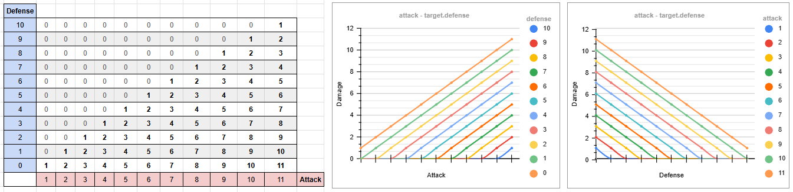

# Appendix 1: Damage Formulas

Combat numbers are not only balance data. The formula itself decides how readable combat feels, how useful defense is, and how hard it is to keep enemies relevant across several dungeon levels.

This appendix compares several damage formulas used in, or inspired by, video game combat systems. The goal is not to find a universal best formula, but to understand what each one does mathematically and what kind of game experience it tends to create.

The most important design question is scale: will attacker power and target defense usually be small values, like units and tens, or large values, like hundreds or thousands? A formula that behaves well with `attack = 8` and `target.defense = 3` can become brittle when both numbers grow to three digits.

!!! tip "Where to experiment"
    The damage formula in the tutorial lives in `Fighter.melee_attack()` in `game/entities/components/fighter.py`. `attack` in the formulas below corresponds to `self.attack`, and `target.defense` to `target.fighter.defense`. To try an alternative, replace the `damage` line in that method.

---

## 1. Simple Linear Formula

```python
damage = max(0, attack - target.defense)
```

This is the formula used in the tutorial because it is easy to read and easy to debug. If the attacker has `5` attack and the defender has `2` defense, the result is `3` damage. There is no hidden curve.

Many traditional roguelikes favor small, readable mitigation systems over large percentage curves. This formula fits that design style: numbers stay small, outcomes are easy to inspect, and players can reason about armor quickly.



### Intuition

The target's defense subtracts directly from incoming damage. Every point of defense prevents exactly one point of damage.

That makes equipment and stats very transparent: `+1 defense` means "take one less damage from each hit." For a teaching project, this clarity is valuable.

### Advantages

- Very easy for players and designers to understand.
- Very easy to implement and inspect in a debugger.
- Works well when attacker and target stats stay small.
- Makes each point of defense feel concrete and predictable.

### Disadvantages

- Damage reaches `0` when `target.defense` equals or exceeds `attack`.
- Scales poorly when stats grow a lot.
- Can create harsh thresholds where an enemy goes from dangerous to harmless after one or two defense upgrades.

### Scaling Behavior

The formula is sensitive to absolute differences. `attack = 10` against `target.defense = 8` deals `2` damage, while `attack = 100` against `target.defense = 98` also deals `2` damage.

Mathematically that is consistent, but game-feel can be strange. A high-attack character fighting a high-defense target may still produce tiny damage numbers if both stats grow at the same pace. The problem compounds when HP scales alongside attack and defense, as it usually does. Two high-level characters dealing 2 damage per hit while each sitting on 200 HP means a hundred turns to resolve a single fight. The formula has not broken, but the gameplay has.

The opposite problem also appears: if attacker power grows faster than target defense, damage grows without resistance. There is no diminishing return or ratio-based control.

[Cross-Formula Adjustments](#cross-formula-adjustments) at the end of this appendix covers additional rules that apply to any formula: minimum damage, rounding, caps, critical hits, and more.

---

## 2. Smoothed Formula with a Scale Constant

```python
damage = (attack * K) / (K + target.defense)
```

This formula makes defense reduce damage by a percentage-like curve instead of subtracting a fixed amount. A version of this pattern appears in many commercial RPGs and online games: rather than blocking a fixed number of points, armor reduces a fraction of incoming damage. It became common in games where stats grow across dozens of levels and pure subtraction would make high-defense characters completely immune to weak enemies.

The constant `K` gives the curve an easy reference point: when `target.defense = K`, damage is half of `attack`. Multiples of `K` continue that pattern: `2 * K` defense reduces damage to one third of `attack`, `3 * K` defense reduces it to one quarter, and so on.

In general:

```text
target.defense = N * K  ->  damage = attack / (N + 1)
```

[Insert graph here showing damage vs target defense with K = 10]

### Intuition

`K` defines the defense scale of the game. It answers this question:

> How much defense should cut incoming damage roughly in half?

If `K = 10`, then `10` defense halves damage. If `K = 50`, then `50` defense halves damage.

Defense always helps, but it has diminishing returns. Going from `0` to `10` defense matters a lot when `K = 10`; going from `100` to `110` matters much less.

### Advantages

- Defense never naturally reduces damage to zero.
- Damage changes smoothly instead of hitting hard thresholds.
- `K` gives designers a direct tuning knob for the whole curve.
- Works better than the linear formula when defense can grow over time.

### Disadvantages

- Less intuitive than direct subtraction.
- A poorly chosen `K` can make defense feel either useless or overpowering.
- Needs rounding if we use integer damage.
- If attacker power grows a lot but `K` stays fixed, defense may stop matching the intended scale unless defense values grow too.

[Insert table here comparing K = 5, K = 10, and K = 25]

### Scaling Behavior

A low `K` makes defense reduce damage very quickly. For example, with `K = 5`, even modest defense values have a strong effect.

A high `K` makes defense softer. With `K = 50`, the defender needs much larger defense values before damage is heavily reduced.

The important point is that `K` is an explicit assumption about stat scale. If your game uses attack and defense values around `5` to `20`, then `K = 10` can be reasonable. If your game uses values around `200`, `K = 10` will make defense behave very aggressively unless defense values are tuned carefully.

[Cross-Formula Adjustments](#cross-formula-adjustments) at the end of this appendix covers additional rules that apply here too: minimum damage, rounding, damage caps, critical hits, and more.

---

## 3. Attacker-Scaled Formula

```python
damage = (attack * attack) / (attack + target.defense)
```

This formula is similar to the previous one, but replaces the fixed constant `K` with the attacker's own `attack` value.

Starting from:

```python
damage = (attack * K) / (K + target.defense)
```

If we set:

```python
K = attack
```

We get:

```python
damage = (attack * attack) / (attack + target.defense)
```

The key idea is that the relevant question is no longer "how much defense do you have?" but "how much defense do you have *relative to your attacker*?" This makes the formula appealing in games where enemies span a wide power range and a single global constant would struggle to stay calibrated across all of them.

[Insert graph here comparing the fixed-K formula against the attacker-scaled formula]

### Intuition

The defense scale follows the attacker. A high-attack creature requires proportionally high defense to reduce its damage. A low-attack creature is affected strongly by even modest defense.

When `target.defense` equals `attack`, damage is cut in half:

```text
damage = attack / 2 when target.defense = attack
```

This makes the formula relative. Defense is not judged against a global constant, but against the offensive level of the attacker.

### Advantages

- Automatically adapts to different attacker scales.
- Avoids hard zero-damage thresholds.
- Keeps defense meaningful relative to the attacker.
- Reduces the need to pick a global `K`.
- Works well when attacker values vary widely across enemies or levels.

### Disadvantages

- Harder to explain than linear subtraction.
- Still needs rounding if we use integer damage.
- Very high attack values can partially overpower moderate defense because the curve scales with attack.
- Designers lose the simple global tuning knob that `K` provided.

[Insert table here showing cases where target defense = 25%, 50%, 100%, and 200% of attack]

### Scaling Behavior

The key behavior is proportional scaling:

- When the attack value is high, the target needs proportionally high defense to reduce damage heavily.
- When the attack value is low, even small defense values have impact.
- The reduction stays relative to the attacker's offensive level.
- When `target.defense` equals `attack`, damage is divided by `2`.

This is useful when enemies across the game have very different attack values. A troll with high attack is not neutralized by the same flat defense value that shuts down an orc.

[Cross-Formula Adjustments](#cross-formula-adjustments) at the end of this appendix covers additional rules that apply here too: minimum damage, rounding, critical hits, armor types, and more.

---

## Cross-Formula Adjustments

The rules in this section are independent of which formula you choose. They can be layered on top of any of the formulas above.

### Minimum Damage

All formulas discussed here can produce zero damage: the linear formula when `target.defense >= attack`, and the smoothed formulas when defense grows large relative to the attacker and the result is rounded down to zero. Whether to guarantee a minimum hit is a design decision.

Consider a horde of weak enemies. There are so many of them that they should be able to hurt you, but if their attack is too low to overcome your defense, every hit deals zero and the threat disappears entirely. A minimum damage rule keeps weak enemies relevant without changing the base formula.

Treat the minimum as a named constant, not a magic number embedded directly in the formula.

- **Fixed minimum** keeps every successful hit relevant:

    ```python
    damage = max(MIN_DAMAGE, formula_result)
    ```

    `MIN_DAMAGE = 1` is the most common choice. It prevents complete shutdown but lets very weak attackers chip away at very strong defenders indefinitely.

- **Percentage-based minimum** scales with the attacker:

    ```python
    damage = max(MIN_DAMAGE_RATIO * attack, formula_result)
    ```

    `MIN_DAMAGE_RATIO = 0.1` guarantees at least 10% of the attacker's `attack` always gets through. The floor grows with the attacker, so it stays proportional across a wide range of values.

    This is usually the better choice when attack values can vary a lot.

### Rounding

Formulas 2 and 3 involve division and produce non-integer results. If you want damage to be a whole number, rounding is needed, but floating-point damage is a valid choice too, especially if HP is also stored as a float. Formula 1 with integer stats never produces decimals, though rounding becomes relevant there too when combined with multiplicative variance.

- **Round down** (`int()` or `math.floor()`): predictable, slightly favors the defender. The most common default.

- **Round up** (`math.ceil()`): keeps attacks more threatening, slightly favors the attacker.

- **Round to nearest** (`round()`): smoother on average, but less transparent to the player.

A common pattern combining rounding with a minimum:

```python
damage = max(MIN_DAMAGE, round(formula_result))
```

### Damage Variance

Adding variance makes repeated attacks feel less mechanical. The same attacker against the same defender produces slightly different results each time.

- **Multiplicative variance** scales with the result:

    ```python
    variance = random.uniform(0.85, 1.15)
    damage = max(MIN_DAMAGE, round(formula_result * variance))
    ```

- **Additive spread** uses a fixed range:

    ```python
    spread = random.randint(-SPREAD, SPREAD)
    damage = max(MIN_DAMAGE, formula_result + spread)
    ```

Multiplicative variance stays proportional at any damage level. Additive spread has more relative impact at low damage values than at high ones.

Some games tie the variance range to attacker skill: a character with high dexterity or long experience with a weapon type produces more consistent damage, while an untrained character swings wildly. In practice this means replacing the fixed bounds (`0.85, 1.15`) with values that narrow as the relevant skill increases. Both stats can contribute at once, or either one alone.

**The trade-off is transparency**:

Variance makes individual hits harder to predict, which adds surprise but reduces the player's ability to plan. Turn-based games with small HP pools, like this tutorial, often skip variance because each hit matters and predictability helps the player understand cause and effect.

### Other Adjustments

These rules can be combined with any of the formulas discussed here:

- **Maximum damage**: cap the result to prevent extreme attack values from one-shotting. Useful when attack can grow without a natural ceiling.
- **Armor penetration**: subtract only a fraction of `target.defense`, or ignore it entirely on special attacks.
- **Hit chance separation**: let defense reduce damage while a separate stat controls whether the attack lands at all (dodge, parry, block). Splits defensive utility across two distinct mechanics.
- **Critical hits**: apply a multiplier to the damage after the base formula. Adds a high-damage outcome without changing the defense side of the formula.
- **Separate armor types**: use different defense values depending on damage source (physical, magical, elemental). Each source then has its own effective defense.

---

## Comparative Summary

[Insert table here comparing all formulas by clarity, scaling, tuning difficulty, and recommended stat range]

### Simple Linear Formula

Use when:

- Attacker and target combat values are small and easy to reason about.
- You want defense to feel direct and tactical.
- You want the player to understand the result without a calculator.
- Your game has few levels of stat inflation.

Avoid it, or add extra rules, when:

- Attacker and target stats can grow into high values.
- You need smooth progression across many tiers of gear.
- You want weak enemies to remain at least slightly threatening.

### Fixed-K Smoothed Formula

Use when:

- You want defense to reduce damage smoothly.
- You want to avoid zero-damage thresholds.
- You know the approximate scale of defense values in advance.
- You want one designer-facing constant to tune the whole curve.

Avoid it, or revisit `K`, when:

- Your stat scale changes dramatically across the game.
- Different enemy families use very different stat ranges.
- You do not want designers to reason about curves or ratios.

### Attacker-Scaled Formula

Use when:

- Attacker values span a wide range.
- You want defense to scale naturally with enemy strength.
- You want fewer global tuning constants.
- You want smoother behavior than `attack - defense`.

Be careful when:

- You want defense to represent a fixed amount of protection.
- You want low-level enemies to remain dangerous against high-defense targets.
- You need very transparent numbers for players.

---

## Choosing a Formula by Stat Scale

Before choosing a formula, decide the expected range of your combat stats.

If attacker power and target defense are low values:

- `attack = 3` to `15`
- `target.defense = 0` to `10`

Then a linear formula is usually fine, especially with a minimum damage rule.

If values grow into larger ranges:

- `attack = 50` to `500`
- `target.defense = 20` to `300`

Then smoothed formulas usually behave better because they avoid abrupt breakpoints and make defense scale more gradually.

The formula is part of the game's progression model. If you change the expected range of attacker power and target defense, revisit the formula too. Balance problems often come not from individual numbers, but from using a formula whose curve no longer matches the scale of the game.
