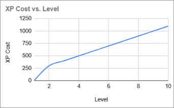
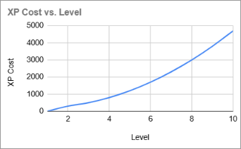

# Part 11: Dungeon Levels and Experience

## What You Will Build

By the end of this part, the player will gain experience from defeating enemies, level up with stat choices, and descend stairs to deeper dungeon floors.

## Learning goals

- Track experience points and character level on a `Level` component
- Show a level-up modal when the player gains enough XP
- Add descending stairs that generate a new dungeon floor
- Introduce `GameWorld` to separate "how to generate maps" from the current map
- Award XP to the killer when an enemy dies

---

## Experience and character progression

Classic roguelikes use an XP curve where each level requires more XP than the last.
The two most common designs are a flat cost per level and an accelerating one.



A **flat (linear) cost** means the player always knows how many fights to expect before
leveling up. Progress feels steady and predictable, but leveling stops feeling like an
event; it becomes background noise.



An **accelerating cost** makes early levels fast and generous, hooking the player
quickly. Later levels require real investment, which makes reaching them feel earned.
The risk is a curve so steep that high levels become practically unreachable.

We use a quadratic formula: each threshold grows by `level * factor`, so early levels
are fast and later ones demand progressively more effort.

| Level | XP cost | Increase |
| ---   | ---     | ---      |
| 2     | 300     | -        |
| 3     | 500     | +200     |
| 4     | 800     | +300     |
| 5     | 1200    | +400     |
| ...   | ...     | +100 * previous level |

The first level-up costs `level_up_base + current_level * level_up_factor` XP (300 at level 1). Each time you level up, the next cost increases by `new_level * level_up_factor`. This matches the growth rate used by games like Diablo from level 8 onwards.

---

## The Level component

Create `game/entities/components/level.py`:

```python
from __future__ import annotations

from game.entities.components.base_component import ActorComponent


class Level(ActorComponent):

    def __init__(
        self,
        current_level  : int = 1,
        current_xp     : int = 0,
        level_up_base  : int = 200,
        level_up_factor: int = 100,
        xp_given       : int = 0,
    ) -> None        :
        self.current_level    = current_level
        self.current_xp       = current_xp
        self.level_up_base    = level_up_base
        self.level_up_factor  = level_up_factor
        self.xp_given         = xp_given
        self.xp_to_next_level = level_up_base + current_level * level_up_factor

    @property
    def requires_level_up(self) -> bool:
        return self.current_xp >= self.xp_to_next_level

    def add_xp(self, xp: int) -> bool:
        if xp == 0 or self.level_up_base == 0:
            return False

        was_ready = self.requires_level_up
        self.current_xp += xp
        return self.requires_level_up and not was_ready

    def increase_level(self) -> None:
        self.current_level    += 1
        self.current_xp       -= self.xp_to_next_level
        self.xp_to_next_level += self.current_level * self.level_up_factor

        # On level up recover all hp points
        self.entity.fighter.heal(self.entity.fighter.max_hp)

    def increase_max_hp(self, amount: int = 20) -> None:
        self.entity.fighter.max_hp += amount
        self.increase_level()

    def increase_attack(self, amount: int = 1) -> None:
        self.entity.fighter.base_attack += amount
        self.increase_level()

    def increase_defense(self, amount: int = 1) -> None:
        self.entity.fighter.base_defense += amount
        self.increase_level()
```

`xp_given` is how much XP an enemy awards on death. Enemies set this; the player leaves it at 0 (the player does not give XP to anything).

`add_xp` returns `True` only when this specific gain crosses the level-up threshold: `was_ready` captures the state before the increment, and the method returns `True` only if the threshold is now met and was not met before. Without this check, a fireball that kills two enemies in one action could trigger the message twice if the first kill already pushed XP past the threshold.

The two early-return guards cover two distinct cases. `if xp == 0` handles enemies (or any entity) with `xp_given=0`: they give no XP when killed and the call returns immediately. `if self.level_up_base == 0` is a defensive opt-out for any entity explicitly constructed with `level_up_base=0`; nothing in the current code triggers it, but it makes it easy to add a deliberately non-leveling entity in the future without modifying `add_xp`.

`increase_level` heals the player to full HP on every level-up. In a difficult roguelike, this makes level-up a meaningful survival tool: a player on low health has a reason to push through one more fight rather than retreat. `increase_max_hp` no longer needs to heal separately because `increase_level` already does it.

!!! info "base_attack and base_defense"
    We renamed the stored values to `base_attack` and `base_defense` to make room for equipment bonuses in Part 13. Both are stored as `float` so that equipment can apply multipliers (e.g. `base_defense *= 1.1`) without losing precision. Keep `attack` and `defense` as properties for now, so existing combat code can keep using `fighter.attack` and `fighter.defense`.

Update `Fighter.__init__` and add the two properties:

```python
self.base_defense = float(defense)
self.base_attack  = float(attack)

@property
def defense(self) -> float:
    return self.base_defense

@property
def attack(self) -> float:
    return self.base_attack
```

---

## Award XP on kill

Rather than passing `engine` into `die()`, we add an `attacker` parameter to `take_damage()` and route XP through that actor. This keeps `Fighter` decoupled from `Engine` and makes XP work for any Actor that deals damage: melee attacks, spells, or summoned allies added later.

We also take this opportunity to clean up how `_hp` is accessed. The `hp` setter existed only to clamp the value and call `die()`. Since `die()` is now triggered from `take_damage`, the setter has no remaining purpose. Removing it means `_hp` is only ever written in two places: `heal` and `take_damage`. A comment on each marks them as the sole mutators, so future readers know exactly where to look.

All other reads, including inside `heal` and `take_damage` themselves, go through the `self.hp` property. This makes `_hp =` a reliable grep target for writes.

Update `game/entities/components/fighter.py`. Remove the `hp` setter entirely, then update `heal` and `take_damage`:

```python
    # only heal and take_damage can write to self._hp
    def heal(self, amount: float) -> float:
        if self.hp == self.max_hp:
            return 0

        new_hp_value = self.hp + amount
        new_hp_value = min(new_hp_value, float(self.max_hp))

        recovered    = new_hp_value - self.hp
        self._hp     = new_hp_value

        return recovered

    # only heal and take_damage can write to self._hp
    def take_damage(self, amount: float, attacker: Actor) -> None:
        self._hp = max(0.0, min(self.hp - amount, float(self.max_hp)))

        if self.hp == 0:
            # Part-10. Ex 2: Record a graveyard file
            # Self-inflicted deaths do not count as kills.
            if attacker is not self.entity:
                attacker.fighter.kill_count += 1
            self.die(attacker)
```

Because `take_damage()` now requires an attacker, update every damage call site that can kill an enemy.

!!! note "Part 10 Exercise 2: graveyard file"
    If you completed that exercise, `take_damage` already has the `attacker` parameter and the call-site updates below are already in place. The only new changes for you are the body of `take_damage` shown above: the `_hp` cleanup and the `self.die(attacker)` call.

In `Fighter.melee_attack()`, pass the actor that is making the attack:

```diff
-            target.fighter.take_damage(damage)
+            target.fighter.take_damage(damage, attacker=self.entity)
```

Update the spell damage in `game/entities/components/consumable.py` too. The player is the `consumer`, so they are the attacker for lightning, fireball, and drain:

```diff
 class LightningDamageConsumable(Consumable):
     ...
-            target.fighter.take_damage(self.damage)
+            target.fighter.take_damage(self.damage, attacker=consumer)

 class FireballDamageConsumable(Consumable):
     ...
-                actor.fighter.take_damage(damage)
+                actor.fighter.take_damage(damage, attacker=consumer)

 class DrainConsumable(Consumable):
     ...
-        target.fighter.take_damage(amount_drained)
+        target.fighter.take_damage(amount_drained, attacker=consumer)
```

Replace the existing `die()` method:

```python
    def die(self, attacker: Actor | None) -> None:
        if self.entity.ai is None:
            death_message = "You died!"
            death_message_color = colors.PLAYER_DEATH
        else:
            death_message = f"The {self.entity.name} is dead!"
            death_message_color = colors.ENEMY_DEATH
            if attacker is not None and hasattr(attacker, "level"):
                if attacker.level.add_xp(self.entity.level.xp_given):
                    MessageLog.add_message("You feel your experience grow!", colors.LEVEL_UP)

        MessageLog.add_message(death_message, death_message_color)

        self.entity.char  = sprites.CORPSE
        self.entity.color = colors.CORPSE
        self.entity.ai    = None
        self.entity.name  = f"remains of {self.entity.name}"
        self.entity.blocks_movement = False
        self.entity.render_order    = RenderOrder.CORPSE
```

!!! tip "Duck typing with `hasattr`"
    `hasattr(attacker, "level")` checks for the presence of one specific attribute at runtime. `isinstance(attacker, Actor)` would also work here since all current attackers are `Actor` instances, but `hasattr` is more targeted: it handles future `Actor` subclasses or variants that may not carry a `Level` component, without requiring changes to `die()`. Note that the check is narrow on purpose: `take_damage` is already typed as `attacker: Actor` and accesses `attacker.fighter` earlier, so the attacker must still be a full Actor; `hasattr` does not make this work for arbitrary objects.

The level-up check (`requires_level_up`) runs in `GameState.handle_events()` after `handle_enemy_turns()` completes. This means if the killing blow crosses the XP threshold, the player still has to survive enemy turns before the level-up screen appears. It is intentional roguelike design: level-up healing is a strategic reward for timing fights well, not a last-second escape from death.

Add to `game/constants/colors.py`:

```python
LEVEL_UP = Color(0xFF, 0xFF, 0x00)
```

---

## Wire up the Level component

Update `game/entities/factories.py` imports, then attach `Level` to every actor:

```diff
+from game.entities.components.level import Level
-from game.entities.entity import Actor, Item
+from game.entities.entity import Actor, Entity, Item
+from game.entities.render_order import RenderOrder

 player = Actor(
     ...
     inventory = Inventory(capacity=10, max_capacity=26),
+    level     = Level(level_up_base=200),
 )

 orc = Actor(
     ...
     inventory = Inventory(capacity=0, max_capacity=0),
+    level     = Level(xp_given=48),
 )

 troll = Actor(
     ...
     inventory = Inventory(capacity=0, max_capacity=0),
+    level     = Level(xp_given=36),
 )
```

The player passes `level_up_base=200` and leaves `xp_given` at 0 (the player does not award XP to anything). Enemies pass only `xp_given` and use the default thresholds (which are never triggered because nothing calls `add_xp` on them).

Update `Actor.__init__` in `game/entities/entity.py` to accept and wire up the `level` component:

```diff
+from game.entities.components.level import Level

 class Actor(Entity):

     def __init__(
         self,
         *,
         ...
+        level: Level,
     ) -> None:
         ...
+        self.level = level
+        self.level.entity = self
```

!!! warning "Save file compatibility"
    Adding `level` to `Actor` changes the structure of pickled objects. Any save file from Part 10 will fail to load correctly. Delete `savegames/savegame.sav` before testing this part.

---

## GameWorld: separating map params from the live map

`Engine` currently holds `game_map` directly. When the player descends stairs, we need to generate a new map with the same parameters but a higher floor number. We extract those parameters into a `GameWorld` class.

Create `game/game_world.py`:

```python
from __future__ import annotations

from typing import TYPE_CHECKING

if TYPE_CHECKING:
    from game.engine import Engine


class GameWorld:
    """Holds the settings for map generation and tracks the current floor."""

    def __init__(
        self,
        *,
        engine: Engine,
        map_width: int,
        map_height: int,
        max_rooms: int,
        room_min_size: int,
        room_max_size: int,
        min_monsters_per_room: int,
        max_monsters_per_room: int,
        min_items_per_room: int,
        max_items_per_room: int,
        seed: int,
        current_floor: int = 0,
    ) -> None:
        self.engine                = engine
        self.map_width             = map_width
        self.map_height            = map_height
        self.max_rooms             = max_rooms
        self.room_min_size         = room_min_size
        self.room_max_size         = room_max_size
        self.min_monsters_per_room = min_monsters_per_room
        self.max_monsters_per_room = max_monsters_per_room
        self.min_items_per_room    = min_items_per_room
        self.max_items_per_room    = max_items_per_room
        self.seed                  = seed
        self.current_floor         = current_floor

    def generate_floor(self) -> None:
        from game.map.map_generator import generate_dungeon

        self.current_floor += 1
        self.engine.game_map = generate_dungeon(
            max_rooms             = self.max_rooms,
            room_min_size         = self.room_min_size,
            room_max_size         = self.room_max_size,
            map_width             = self.map_width,
            map_height            = self.map_height,
            min_monsters_per_room = self.min_monsters_per_room,
            max_monsters_per_room = self.max_monsters_per_room,
            min_items_per_room    = self.min_items_per_room,
            max_items_per_room    = self.max_items_per_room,
            player                = self.engine.player,
            seed                  = self.seed + self.current_floor,
        )
```

`seed + self.current_floor` keeps the run reproducible while still giving each dungeon floor a different layout. Using the exact same seed for every floor would generate the same dungeon again.

!!! info "Keyword-only arguments"
    `def __init__(self, *, engine, ...)`: the bare `*` forces every argument after it to be passed by name: `GameWorld(engine=engine, map_width=80, ...)`. Positional calls like `GameWorld(engine, 80, 48, ...)` raise a `TypeError` immediately. This is a useful safeguard for constructors with many parameters of the same type: swapping two `int` arguments positionally is a silent bug, but swapping keyword arguments is obvious from the call site.

Update `Engine` in `game/engine.py`. The engine will no longer receive `game_map` through its constructor: the map is created later by `GameWorld.generate_floor()`, which assigns it directly to `engine.game_map`. Add class-level annotations so the type checker knows both attributes will exist even though neither is set in `__init__`, and remove `self.update_fov()` from the constructor (it will be called from `new_game()` after the first floor is generated):

```diff
+from game.game_world import GameWorld

 class Engine:
+    game_map: GameMap
+    game_world: GameWorld

-    def __init__(self, game_map: GameMap, player: Actor, ...) -> None:
-        self.game_map = game_map
+    def __init__(self, player: Actor, ...) -> None:
         self.mouse_location: tuple[int, int] = (0, 0)
         self.player = player
         ...
-        self.update_fov()
```

If you completed exercises from previous parts, keep `fov_radius`, `fading_memory`, `memory_duration`, and `turn_count` as optional parameters in `__init__`. They stay on the engine and are not affected by this change.

Update `game/setup_game.py`, replace the direct `generate_dungeon` call with `GameWorld`:

```diff
-from game.map.map_generator import generate_dungeon
+from game.game_world import GameWorld

 def new_game() -> Engine:
     ...
-    game_map = generate_dungeon(
-        max_rooms             = MAX_ROOMS,
-        room_min_size         = ROOM_MIN_SIZE,
-        room_max_size         = ROOM_MAX_SIZE,
-        map_width             = MAP_WIDTH,
-        map_height            = MAP_HEIGHT,
-        min_monsters_per_room = MIN_MONSTERS_PER_ROOM,
-        max_monsters_per_room = MAX_MONSTERS_PER_ROOM,
-        min_items_per_room    = MIN_ITEMS_PER_ROOM,
-        max_items_per_room    = MAX_ITEMS_PER_ROOM,
-        player                = player,
-        seed                  = seed,
-    )
-
-    engine = Engine(game_map=game_map, player=player)
+    engine = Engine(player=player)
+    engine.game_world = GameWorld(
+        engine                = engine,
+        max_rooms             = MAX_ROOMS,
+        room_min_size         = ROOM_MIN_SIZE,
+        room_max_size         = ROOM_MAX_SIZE,
+        map_width             = MAP_WIDTH,
+        map_height            = MAP_HEIGHT,
+        min_monsters_per_room = MIN_MONSTERS_PER_ROOM,
+        max_monsters_per_room = MAX_MONSTERS_PER_ROOM,
+        min_items_per_room    = MIN_ITEMS_PER_ROOM,
+        max_items_per_room    = MAX_ITEMS_PER_ROOM,
+        seed                  = seed,
+    )
+    engine.game_world.generate_floor()
+    engine.update_fov()
```

---

## Stairs in the map generator

Add to `game/constants/sprites.py`:

```python
DOWN_STAIRS = ">"
```

Add to `game/constants/colors.py`:

```python
DOWN_STAIRS = Color(255, 255, 100)
```

Add stairs to `game/entities/factories.py`:

```python
down_stairs = Entity(
    char            = sprites.DOWN_STAIRS,
    color           = colors.DOWN_STAIRS,
    name            = "Stairs",
    blocks_movement = False,
    render_order    = RenderOrder.ITEM,
)
```

Add `downstairs_location` to `GameMap`:

```python
class GameMap:
    downstairs_location: tuple[int, int] = (0, 0)
```

Place a staircase in the last room, in a free cell not occupied by any entity. Update `game/map/map_generator.py`:

```diff
+from game.entities import factories
 from game.entities.entity import Entity

 ...

 def place_entities(...) -> None:
     ...
-    # Local import to break a circular dependency at module level:
-    # map_generator -> factories -> AI -> actions -> engine -> game_map.
-    from game.entities import factories

 ...

 def generate_dungeon(...) -> GameMap:
     ...
+    last_room = rooms[-1]
+    free = [
+        (x, y)
+        for x in range(last_room.x1 + 1, last_room.x2)
+        for y in range(last_room.y1 + 1, last_room.y2)
+        if not any(e.x == x and e.y == y for e in dungeon.entities)
+    ]
+    stair_pos = random.choice(free) if free else last_room.center
+    dungeon.downstairs_location = stair_pos
+    factories.down_stairs.spawn(dungeon, *stair_pos)
+
     return dungeon
```

`place_entities` already ran, so items or monsters may occupy any cell in the last room. `free` is a list comprehension with an `if` clause: it keeps only the room cells where no entity already exists. `random.choice(free) if free else last_room.center` chooses a random free cell when possible, and falls back to the room center if the room somehow has no free cells. Because the list is built by walking the room in a fixed order, the same seed can reproduce the same stair placement.

Moving `from game.entities import factories` to the top of the file is now safe. In earlier parts, it had to stay inside `place_entities` because importing it at module level created an import cycle: `map_generator → factories → AI → actions → engine`, and `engine` imported `generate_dungeon` from `map_generator`. Now that responsibility belongs to `GameWorld.generate_floor`, which uses a local import; `engine.py` no longer imports `map_generator` at module level, so the cycle is gone.

---

## TakeStairsAction

Add to `game/constants/colors.py`:

```python
DESCEND = Color(0x9F, 0x3F, 0xFF)
```

Add to `game/actions.py`:

```python
class TakeStairsAction(Action):

    def perform(self, engine: Engine, entity: Entity) -> None:
        if (entity.x, entity.y) == engine.game_map.downstairs_location:
            engine.game_world.generate_floor()
            MessageLog.add_message(
                "You descend the staircase.", colors.DESCEND
            )

        else:
            raise Impossible("There are no stairs here.")
```

Add `KEY_DESCEND` to `game/constants/keys.py`:

```python
KEY_DESCEND = {tcod.event.KeySym.RETURN, tcod.event.KeySym.KP_ENTER}
```

Add `TakeStairsAction` to the imports in `game/game_states.py`:

```diff
 from game.actions import (
     Action,
     ...
+    TakeStairsAction,
     WaitAction,
 )
```

Then use it in `MainGameState`:

```python
        if key in keys.KEY_DESCEND:
            return TakeStairsAction()
```

---

## LevelUpState

Add to `game/game_states.py`:

```python
class LevelUpState(GameState):
    TITLE = "Level Up"

    def on_render(self, console: tcod.console.Console) -> None:
        super().on_render(console)

        x, y = 40, 0
        width = 35

        console.draw_frame(
            x      = x,
            y      = y,
            width  = width,
            height = 8,
            clear  = True,
            fg     = colors.WHITE,
            bg     = colors.BLACK,
        )

        title = f" {self.TITLE} "
        console.print(x + (width - len(title)) // 2, y, title, fg=colors.WHITE, bg=colors.BLACK)

        console.print(x=x + 1, y=y + 1, text="Congratulations! You level up!")
        console.print(x=x + 1, y=y + 2, text="Select an attribute to increase.")

        fighter = self.engine.player.fighter
        console.print(
            x=x + 1, y=y + 4,
            text=f"a) Constitution (+20 HP, from {fighter.max_hp})",
        )
        console.print(
            x=x + 1, y=y + 5,
            text=f"b) Strength (+1 attack, from {fighter.base_attack})",
        )
        console.print(
            x=x + 1, y=y + 6,
            text=f"c) Agility (+1 defense, from {fighter.base_defense})",
        )

    def event_keydown(self, event: tcod.event.KeyDown) -> BaseGameState | None:
        player = self.engine.player
        index  = event.sym - tcod.event.KeySym.A

        if index == 0:
            player.level.increase_max_hp()

        elif index == 1:
            player.level.increase_attack()

        elif index == 2:
            player.level.increase_defense()

        else:
            MessageLog.add_message("Invalid entry.", colors.INVALID)
            return None

        return MainGameState(self.engine)

    def handle_events(self, event: tcod.event.Event) -> BaseGameState:
        result = super().handle_events(event)
        if result is not self:
            return result

        # Stay in level-up screen until a valid choice is made.
        return self
```

Trigger the modal from `GameState.handle_events()` after `update_fov()`:

```diff
             self.engine.update_fov()

+            if self.engine.player.level.requires_level_up:
+                return LevelUpState(self.engine)
+
             if isinstance(self, ActionModalState):
```

---

## Show floor and gold in the UI

Redesign the top two rows of the HUD panel:

```txt
Floor: 1          $ 0
[   HP: 30/30      ]
```

**Step 1.** Add a module-level constant to `game/hud.py` and give `render_bar` a default for `total_width`:

```diff
+BAR_WIDTH = 20

 def render_bar(
     console      : Console,
     current_value: float,
     maximum_value: int,
-    total_width  : int,
+    total_width  : int = BAR_WIDTH,
     y            : int = 45,
 ) -> None:
```

**Step 2.** Center the HP text inside the bar in `render_bar`:

```diff
-    console.print(
-        x    = 1,
-        y    = y,
-        text = f"HP: {int(current_value)}/{maximum_value}",
-        fg   = colors.BAR_TEXT,
-    )
+    hp_text = f"HP: {int(current_value)}/{maximum_value}"
+    console.print(
+        x    = (total_width - len(hp_text)) // 2,
+        y    = y,
+        text = hp_text,
+        fg   = colors.BAR_TEXT,
+    )
```

**Step 3.** Add `FLOOR` to `game/constants/colors.py`:

```python
FLOOR = Color(0x00, 0xD7, 0xFF)
```

**Step 4.** Update `render_gold` to right-align gold within the bar width, and add `render_dungeon_level` to show the current floor on the left of the same row:

```python
def render_gold(
    console    : Console,
    gold       : int,
    total_width: int = BAR_WIDTH,
    y          : int = 44,
) -> None:
    text = f"$ {gold}"
    console.print(x=total_width - len(text), y=y, text=text, fg=colors.GOLD)


def render_dungeon_level(
    console      : Console,
    dungeon_floor: int,
    y            : int = 44,
) -> None:
    console.print(x=0, y=y, text=f"Floor: {dungeon_floor}", fg=colors.FLOOR)
```

**Step 5.** Update `Engine.render()`: drop the now-redundant `total_width` from the bar call and add the floor display:

```diff
         hud.render_bar(
             console       = console,
             current_value = self.player.fighter.hp,
             maximum_value = self.player.fighter.max_hp,
-            total_width   = 20,
         )

         hud.render_gold(
             console = console,
             gold    = self.player.inventory.gold,
         )
+
+        hud.render_dungeon_level(
+            console       = console,
+            dungeon_floor = self.game_world.current_floor,
+        )
```

---

## Testing your work

Run `python main.py`:

- [ ] Killing enemies with melee, lightning, fireball, or drain counts toward level-up XP
- [ ] After enough XP, a level-up screen appears with three stat choices
- [ ] Selecting an option increases the stat and closes the modal
- [ ] Finding stairs and pressing Enter generates a new floor
- [ ] The player's HP, inventory, and level persist across floor transitions
- [ ] Enemies and items are freshly generated on each new floor
- [ ] The floor counter in the UI increments when descending

---

## Summary

Character progression and dungeon depth are now linked. Key additions:

- **`Level` component**: XP tracking, level-up threshold, stat-increase methods
- **`GameWorld`**: owns generation parameters, creates new floors on demand
- **`TakeStairsAction`**: triggers floor generation when player is on stairs
- **`LevelUpState`**: modal stat-selection screen
- **XP on kill**: `Fighter.die()` awards XP to the player

**Current architecture**:

- `GameWorld`: owns dungeon generation parameters and current floor number
- `Engine`: owns the current `GameMap` plus a `GameWorld` for new floors
- `Level`: component that owns XP, level thresholds, and stat increases
- `TakeStairsAction`: asks `GameWorld` to generate the next floor
- `LevelUpState`: modal state entered when the player must choose a stat

**File structure**:

```text
main.py
game/
├── __init__.py
├── actions.py                  ← modified
├── engine.py                   ← modified
├── exceptions.py
├── game_world.py               ← new
├── hud.py                      ← modified
├── game_states.py              ← modified
├── message_log.py
├── setup_game.py               ← modified
├── constants/
│   ├── __init__.py
│   ├── colors.py               ← modified
│   └── sprites.py              ← modified
├── entities/
│   ├── __init__.py
│   ├── entity.py               ← modified
│   ├── factories.py            ← modified
│   ├── render_order.py
│   └── components/
│       ├── __init__.py
│       ├── ai.py
│       ├── base_component.py
│       ├── consumable.py       ← modified
│       ├── fighter.py          ← modified
│       ├── inventory.py
│       └── level.py            ← new
└── map/
    ├── __init__.py
    ├── game_map.py
    ├── tile_types.py
    └── map_generator.py        ← modified
```

---

## Exercises

1. **XP display**:

    Show current XP and XP-to-next-level in the UI panel: `"XP: 120 / 300"`. Add a second small bar next to the HP bar.

2. **Persistent floors**:

    Store each generated `GameMap` in a list inside `GameWorld`. When the player descends, generate a new floor. When they ascend (add `<` stairs), restore the previous map. This requires saving entity positions and the player being removed from the old map before being placed on the new one.

3. **Level cap**:

    Cap the player at level 10. Above level 10, `add_xp` still accumulates but `requires_level_up` always returns `False`. Print `"You are at maximum level."` instead of the modal.
