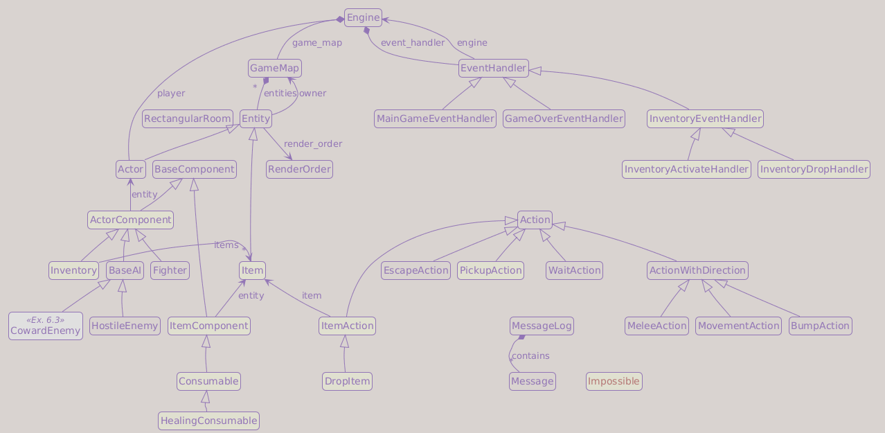

# Part 8: Items and Inventory

## Learning goals

- Add `Item` as a new entity class and `HealingConsumable` as its first component
- Give every entity an `owner` field so items know whether they are on the floor or in an inventory
- Add an `Inventory` component to actors and implement pickup, use, and drop actions
- Raise `Impossible` for action rejections that need player-facing feedback
- Build a letter-keyed inventory overlay using the modal handler pattern
- Spawn health potions in the dungeon

---

## Where does an item live?

Before writing any code, consider the central design question: a health potion needs to exist in two places.

When it is on the dungeon floor, the map owns it. When the player picks it up, the inventory owns it. It is the same Python object in both cases; only its *owner* changes. How does the game track which owner currently holds it?

The answer is an `owner` field on `Entity`. Every entity stores a reference to its current owner:

```txt
On the dungeon floor:
  Item
  └── owner = GameMap

In the player's inventory:
  Item
  └── owner = Inventory
```

In both cases the item is the same Python object, only `owner` changes. The field is the single source of truth for where an entity is: on the floor or in an inventory.

This chapter also introduces a second architectural change: **important action rejections should say why**. The old approach was to return silently (or return `None`). The new approach raises an `Impossible` exception for cases where the player needs feedback, with the reason as its message. A single `try/except` in the event handler intercepts every `Impossible` rejection and shows it in the message log.

---

## `game/exceptions.py`

Create a new file:

```python
from __future__ import annotations


class Impossible(Exception):
    """Exception raised when an action is impossible. The reason is the exception message."""
```

!!! info "Exceptions as control flow"
    Python uses exceptions for unexpected bugs, but also for *expected* failures: requesting an impossible action, reading past the end of a file, looking up a missing key. Raising `Impossible` is not a bug, it is a structured way to carry a rejection reason out of any call depth without threading a return value through every intermediate function.

Compare the alternatives. Returning `None` is silent: the caller has to check for it and decide what to tell the player. Returning a `bool` is only marginally better: the caller knows the action failed, but not why. Raising `Impossible("Your inventory is full.")` gives the reason for free, and a single `except Impossible as ex:` in the event handler catches every `Impossible` case with `str(ex)`.

---

## New constants

Two new visual elements arrive in this chapter: the health potion sprite and colors for item messages. Add them to the constants files.

In `game/constants/sprites.py`:

```diff
 CHEST   = "$"
 CORPSE  = "%"
+
+# Items
+HEALTH_POTION = "!"
```

In `game/constants/colors.py`, add an item color and two new message colors. Place the item color in the entity colors section (after `CORPSE`), and the message colors near the other UI colors:

```diff
 CORPSE        = (191,   0,   0)
+
+# Item colors
+HEALTH_POTION = (127, 0, 255)
```

```diff
 ENEMY_DEATH      = (0xFF, 0xA0, 0x30)
+HEALTH_RECOVERED = (0x00, 0xFF, 0x00)
```

```diff
 WELCOME_TEXT = (0x20, 0xA0, 0xFF)
 ...
+INVALID      = (0xFF, 0xFF, 0x00)
```

`HEALTH_RECOVERED` is bright green for HP-restore messages. `INVALID` is yellow for action-rejection messages.

---

## Narrowing component types

Every component in `game/entities/components/base_component.py` declares `entity: Entity`. That annotation is incorrect. A `Fighter` component's entity is always an `Actor`, it will never be a plain `Entity` or an `Item`. Once this chapter moves `ai` off `Entity`, `entity: Entity` no longer describes the design accurately: `self.entity.ai` and `self.entity.is_alive` are `Actor` attributes, and `Entity` does not declare them.

!!! question "What do we gain by narrowing?"
    After `ai` moves to `Actor`, the annotation `entity: Entity` is incomplete: `Entity` does not have `ai`, but `Fighter` accesses `self.entity.ai`. The attribute exists at runtime because `Fighter` is always attached to an `Actor`, but the declared type does not capture that invariant. Narrowing to `entity: Actor` makes the annotation accurate, and a type checker can verify the access correctly as a result.

By introducing `ActorComponent` (where `entity: Actor`) and `ItemComponent` (where `entity: Item`), we make the annotations correct: certain components are *always* actor components, others are *always* item components. The annotation narrows from `Entity` to the actual runtime type, so the declared type finally matches the design.

Update `game/entities/components/base_component.py`:

```diff
 from __future__ import annotations

 from typing import TYPE_CHECKING

 if TYPE_CHECKING:
-    from game.entities.entity import Entity
+    from game.entities.entity import Actor, Item


 class BaseComponent:
-    entity: Entity  # set by the owning Entity after creation
+    pass


+class ActorComponent(BaseComponent):
+    entity: Actor
+
+
+class ItemComponent(BaseComponent):
+    entity: Item
```

!!! info "Why keep `BaseComponent` at all?"
    `BaseComponent` has no `entity` annotation because the type of `entity` depends on whether the component belongs to an `Actor` or an `Item`: it is not meaningful at this level. `ActorComponent` and `ItemComponent` carry the correct declarations. `BaseComponent` is kept as their common ancestor in case future code needs to refer to "any component" generically (a debug inspector, a serialization layer, or a plugin system). If your project never needs that, you can remove `BaseComponent` entirely and make `ActorComponent` and `ItemComponent` independent classes.

Now update each existing component to use the correct base class. In `game/entities/components/fighter.py`:

```diff
-from game.entities.components.base_component import BaseComponent
+from game.entities.components.base_component import ActorComponent

 ...

-class Fighter(BaseComponent):
+class Fighter(ActorComponent):
```

In `game/entities/components/ai.py`:

```diff
-from game.entities.components.base_component import BaseComponent
+from game.entities.components.base_component import ActorComponent

 ...

-class BaseAI(BaseComponent):
+class BaseAI(ActorComponent):
```

`ItemComponent` declares `entity: Item`, but `Item` does not exist yet in `entity.py`. Add a one-line stub now so the annotation refers to a real class from the start:

```diff
+class Item(Entity):
+    pass
```

Step 6 in the next section replaces this stub with the full implementation.

The two new components introduced in this chapter (`Inventory` and `Consumable`) will use the correct bases from the start.

---

## Updating `game/entities/entity.py`

`entity.py` changes in several steps. Each step introduces one concept before the next one depends on it.

### Step 1: Remove `ai` from `Entity` and expand TYPE_CHECKING imports

`ai` is an `Actor` concern, not an `Entity` concern. Plain entities (passive blockers, map decorations) never have AI. Keeping it on the base class was a holdover from before `Actor` existed.

At the same time, add the imports that the new classes and annotations in this chapter require:

```diff
 if TYPE_CHECKING:
     from game.entities.components.ai import BaseAI
+    from game.entities.components.consumable import Consumable
+    from game.entities.components.inventory import Inventory
     from game.map.game_map import GameMap


 class Entity:

     def __init__(
         self,
         x: int = 0,
         ...
         render_order: RenderOrder = RenderOrder.UNKNOWN,
-        ai: BaseAI | None = None,
     ) -> None:
         self.x               = x
         ...
         self.render_order    = render_order
-        self.ai              = ai
```

### Step 2: Add the `owner` field

Every entity now tracks its owner. The field is declared in two places, and each serves a different purpose.

The class-level annotation covers the full range of values the field can hold at runtime:

```diff
 class Entity:
+    owner: GameMap | Inventory | None
+
     def __init__(
```

The `__init__` parameter is intentionally narrower:

```python
owner: GameMap | None = None
```

The constructor parameter is `GameMap | None` because those are the only valid *initial* states: an entity is always created either on the map or with no owner yet. Accepting `Inventory` at construction time would be misleading.

The class-level annotation covers the full *lifetime* of the attribute. Over its life, `owner` moves from `None` (template) to `GameMap` (spawned) to `Inventory` (picked up) and back to `GameMap` (dropped). Those are all valid states, just not at construction time.

This is a useful Python pattern: declare the field's full type at class level, and use a narrower `__init__` parameter for the valid initial values. The class-level annotation is authoritative; the assignment in `__init__` is just the first of several values the field will take. A type checker respects the class-level declaration and will not flag the later reassignments to `Inventory`.

Add `owner` as the first parameter of `__init__`, and auto-register the entity when an owner is provided:

```diff
     def __init__(
         self,
+        owner: GameMap | None = None,
         x: int = 0,
         y: int = 0,
         ...
         render_order: RenderOrder = RenderOrder.UNKNOWN,
     ) -> None:
+        self.owner           = owner
         self.x               = x
         ...
         self.render_order    = render_order
+        if owner:
+            owner.entities.add(self)
```

The constructor parameter is `GameMap | None`: entities start on the map or unowned. Item *templates* (defined in `game/entities/factories.py`) are created with no owner. When `spawn()` places a clone on the floor, the clone gets `owner = dungeon`. When `PickupAction` picks it up, `item.owner` changes to `inventory`. The class-level annotation covers all three runtime states.

!!! info "The three ownership states"
    ```txt
    Template:     entity.owner = None
    On the map:   entity.owner = GameMap
    In inventory: entity.owner = Inventory
    ```

    Templates should never need a map reference. When spawned entities or inventory items need the map (for example, to drop an item back on the floor), the caller passes `game_map` explicitly.

### Step 3: Update `spawn()`

`spawn()` existed since Part 5. It creates a deep copy and adds it to the map's entity set. Now it also sets `owner` on the clone:

```diff
     def spawn(self, game_map: GameMap, x: int, y: int) -> Entity:
         clone = copy.deepcopy(self)
         clone.x     = x
         clone.y     = y
+        clone.owner = game_map
         game_map.entities.add(clone)
         return clone
```

### Step 4: Add `place()`

`place()` moves an entity to a new position and optionally transfers it to a new owner. The inventory `drop()` method calls it to return an item to the dungeon floor:

```diff
+    def place(self, x: int, y: int, game_map: GameMap | None = None) -> None:
+        from game.map.game_map import GameMap
+        self.x = x
+        self.y = y
+        if game_map:
+            if self.owner is not None:
+                if isinstance(self.owner, GameMap):
+                    self.owner.entities.discard(self)
+
+            self.owner = game_map
+            game_map.entities.add(self)
+
     def set_position(self, x: int, y: int) -> None:
```

The local import makes `GameMap` available at runtime without introducing a module-level circular import. `self.owner is not None` guards against placing a fresh template entity for the first time. Once that check passes, `isinstance(self.owner, GameMap)` determines whether the entity is registered directly with the map and needs to be removed from it: items being dropped from inventory have `owner = Inventory`, so the isinstance check is `False` and the discard is skipped correctly.

### Step 5: Add `inventory` to `Actor` and fix the `ai` annotation

`Actor` now requires an `Inventory` component. This step also cleans up the `ai` wiring: since `Entity` no longer accepts `ai`, `Actor` must own the attribute directly.

Update `Actor.__init__`:

```diff
     def __init__(
         self,
         *,
         x: int    = 0,
         y: int    = 0,
         char: str = sprites.UNKNOWN,
         color: tuple[int, int, int] = colors.DEFAULT_FG,
         name: str = "<unnamed>",
         ai: BaseAI | None = None,
         fighter: Fighter,
+        inventory: Inventory,
     ) -> None:
         super().__init__(
             x               = x,
             y               = y,
             char            = char,
             color           = color,
             name            = name,
             blocks_movement = True,
             render_order    = RenderOrder.ACTOR,
-            ai              = ai,
         )
         self.fighter = fighter
         self.fighter.entity = self

-        if self.ai:
-            self.ai.entity = self
+        self.inventory = inventory
+        self.inventory.entity = self
+
+        self.ai: BaseAI | None = ai
+        if self.ai:
+            self.ai.entity = self
```

`ai=ai` is no longer passed to `super().__init__()` because `Entity` no longer accepts it. `self.ai: BaseAI | None = ai` both annotates and assigns the attribute in one statement, which is the correct Python pattern: the annotation belongs at the point of declaration, not split across conditional branches.

### Step 6: Add the `Item` class

`Item` is parallel to `Actor`: a specialised entity with its own required component. Replace the stub with the full class:

```diff
-class Item(Entity):
-    pass
+class Item(Entity):
+
+    def __init__(
+        self,
+        *,
+        x: int = 0,
+        y: int = 0,
+        char: str = sprites.UNKNOWN,
+        color: tuple[int, int, int] = colors.DEFAULT_FG,
+        name: str = "<unnamed>",
+        consumable: Consumable,
+    ) -> None:
+        super().__init__(
+            x=x,
+            y=y,
+            char=char,
+            color=color,
+            name=name,
+            blocks_movement=False,
+            render_order=RenderOrder.ITEM,
+        )
+        self.consumable = consumable
+        self.consumable.entity = self
```

Items do not usually block movement (you can stand on top of a potion) and render at `RenderOrder.ITEM`, below actors and above the floor.

---

## Add `items` to `GameMap`

`PickupAction` needs to iterate over items on the map. Add a filtered property to `game/map/game_map.py`:

```diff
 if TYPE_CHECKING:
-    from game.entities.entity import Actor, Entity
+    from game.entities.entity import Actor, Entity, Item

 ...

     @property
     def actors(self) -> Iterator[Actor]:
         ...

+    @property
+    def items(self) -> Iterator[Item]:
+        from game.entities.entity import Item
+        yield from (e for e in self.entities if isinstance(e, Item))
```

---

## Create `game/entities/components/inventory.py`

```python
from __future__ import annotations

from typing import TYPE_CHECKING

from game.entities.components.base_component import ActorComponent

if TYPE_CHECKING:
    from game.entities.entity import Item
    from game.map.game_map import GameMap


class Inventory(ActorComponent):

    def __init__(self, capacity: int) -> None:
        self.capacity = capacity
        self.items: list[Item] = []

    def drop(self, item: Item, game_map: GameMap) -> None:
        self.items.remove(item)
        item.place(self.entity.x, self.entity.y, game_map)
```

`drop()` removes the item from `items`, then calls `item.place()` to move it back to the dungeon floor at the actor's current position. The caller passes `game_map` explicitly: `DropItem.perform` already has `engine` and can supply `engine.game_map` directly, so `Inventory` does not need to navigate the ownership chain itself.

---

## Create `game/entities/components/consumable.py`

```python
from __future__ import annotations

from typing import TYPE_CHECKING

from game.entities.components.base_component import ItemComponent
from game.constants import colors
from game.exceptions import Impossible
from game.message_log import MessageLog

if TYPE_CHECKING:
    from game.actions import Action, ItemAction
    from game.engine import Engine
    from game.entities.entity import Actor


class Consumable(ItemComponent):

    def get_action(self, _consumer: Actor, _engine: Engine) -> Action | None:
        """Return the action this consumable produces when used."""
        from game.actions import ItemAction

        return ItemAction(item=self.entity)

    def activate(self, _action: ItemAction, _engine: Engine, _consumer: Actor) -> None:
        """Apply this consumable's effect. Must be overridden."""
        raise NotImplementedError()

    def consume(self) -> None:
        """Remove the item from the holder's inventory."""
        from game.entities.components.inventory import Inventory

        entity = self.entity
        inventory = entity.owner
        if isinstance(inventory, Inventory) and entity in inventory.items:
            inventory.items.remove(entity)
            entity.owner = None


class HealingConsumable(Consumable):

    def __init__(self, amount: int) -> None:
        self.amount = amount

    def activate(self, _action: ItemAction, _engine: Engine, consumer: Actor) -> None:
        amount_recovered = consumer.fighter.heal(self.amount)

        if amount_recovered > 0:
            MessageLog.add_message(
                f"You consume the {self.entity.name}, and recover {amount_recovered} HP!",
                colors.HEALTH_RECOVERED,
            )
            self.consume()

        else:
            raise Impossible("Your health is already full.")
```

`Consumable.get_action()` returns the action produced by using this item. In this chapter it returns a plain `ItemAction`, but future consumable types can override it to request additional input before acting, for example a targeting scroll that needs a destination tile.

`consume()` imports `Inventory` locally to avoid a circular import: `consumable.py` and `inventory.py` would otherwise form a cycle at module level. The `isinstance` check serves double duty: it guards against consuming an unowned item and narrows the declared type from `GameMap | Inventory | None` to `Inventory`, making the subsequent `inventory.items` access well-typed. After removing the item, `entity.owner = None` clears the stale reference so the consumed item no longer points at the inventory it came from.

`HealingConsumable.activate()` calls `fighter.heal()`, which you wrote in Part 7. If the player is already at full health, `heal()` returns `0` and `activate()` raises `Impossible`. The event handler will catch it and show the reason as a yellow message.

---

## Update `game/entities/factories.py`

Every `Actor` now requires an `Inventory`. Add the component to the existing templates:

```diff
 from game.entities.components.ai import HostileEnemy
+from game.entities.components.consumable import HealingConsumable
 from game.entities.components.fighter import Fighter
+from game.entities.components.inventory import Inventory
 from game.constants import colors, sprites
-from game.entities.entity import Actor, Entity
+from game.entities.entity import Actor, Entity, Item
```

```diff
 player = Actor(
     char      = sprites.PLAYER,
     color     = colors.PLAYER,
     name      = "Player",
     ai        = None,
     fighter   = Fighter(hp=30, defense=2, attack=5),
+    inventory = Inventory(capacity=26),
 )

 orc = Actor(
     char      = sprites.ORC,
     color     = colors.ORC,
     name      = "Orc",
     ai        = HostileEnemy(),
     fighter   = Fighter(hp=10, defense=0, attack=3),
+    inventory = Inventory(capacity=0),
 )

 troll = Actor(
     char      = sprites.TROLL,
     color     = colors.TROLL,
     name      = "Troll",
     ai        = HostileEnemy(),
     fighter   = Fighter(hp=16, defense=1, attack=4),
+    inventory = Inventory(capacity=0),
 )
```

Enemies get `capacity=0`: their inventory exists (so the type is satisfied) but they cannot hold any items. An orc that walks over a potion will not pick it up.

Then add the health potion template at the bottom of the file:

```python
# Items
health_potion = Item(
    char       = sprites.HEALTH_POTION,
    color      = colors.HEALTH_POTION,
    name       = "Health Potion",
    consumable = HealingConsumable(amount=4),
)
```

---

## Update `game/actions.py`

Add the three new action classes and two new imports at the top of the file:

```diff
+from game.entities.entity import Actor, Item
+from game.exceptions import Impossible
 from game.message_log import MessageLog
```

```python
class PickupAction(Action):

    def perform(self, engine: Engine, entity: Entity) -> None:
        assert isinstance(entity, Actor)
        inventory = entity.inventory

        for item in engine.game_map.items:
            if entity.x == item.x and entity.y == item.y:
                if len(inventory.items) >= inventory.capacity:
                    raise Impossible("Your inventory is full.")

                engine.game_map.entities.discard(item)
                item.owner = inventory
                inventory.items.append(item)

                MessageLog.add_message(f"You picked up the {item.name}!")
                return

        raise Impossible("There is nothing here to pick up.")


class ItemAction(Action):

    def __init__(self, item: Item) -> None:
        super().__init__()
        self.item = item

    def perform(self, engine: Engine, entity: Entity) -> None:
        assert isinstance(entity, Actor)
        self.item.consumable.activate(self, engine, entity)


class DropItem(ItemAction):

    def perform(self, engine: Engine, entity: Entity) -> None:
        assert isinstance(entity, Actor)
        entity.inventory.drop(self.item, engine.game_map)
        MessageLog.add_message(f"You dropped the {self.item.name}.")
```

`PickupAction` iterates `engine.game_map.items` (the new property) looking for an item at the player's position. If found, it removes the item from the map's entity set, sets `item.owner = inventory`, and appends it to `inventory.items`. Both trailing `raise Impossible` statements ensure the player always gets feedback.

`ItemAction` delegates to `consumable.activate()`. `DropItem` extends `ItemAction` because dropping also needs the item reference, but calls `inventory.drop()` instead.

The `assert isinstance(entity, Actor)` calls enforce a design contract: `Action.perform` is declared with `entity: Entity`, but these three actions require an `Actor` (only actors have `inventory`). The asserts make that constraint explicit at runtime and narrow the declared type, so a type checker can verify the subsequent attribute accesses without casts.

Also add `PickupAction` to the import list at the top of `game/input_handlers.py`:

```diff
-from game.actions import (Action, BumpAction, EscapeAction, WaitAction)
+from game.actions import (Action, BumpAction, EscapeAction, PickupAction, WaitAction)
```

---

## Move action execution into `EventHandler`

So far `Engine.handle_events()` ran the action returned by the event handler. That worked when there was only one handler, but modal handlers (the inventory overlay) need to switch the active handler *after* an action completes. Only the handler knows which handler it should return to; the engine does not.

!!! info "Why move execution into the handler?"
    `Engine.handle_events()` currently does: get action from handler, perform it, run enemy turns, update FOV. That is fine with one handler. But when the inventory overlay is open, pressing `a` should use the item *and then close the overlay* (returning to `MainGameEventHandler`). The engine cannot make that switch because it does not know which handler to return to. The handler does: it opened the overlay, so it knows to close it.

    Moving the execution loop into `EventHandler.handle_events()` gives each handler control over what happens after an action.

Update `game/engine.py`. The `handle_events` signature changes from `Iterable[Any]` to `Iterable[tcod.event.Event]`, so `Any` is no longer needed:

```diff
-from typing import Any

 import tcod.event
```

Then simplify `handle_events()` to a one-line dispatch:

```diff
-def handle_events(self, events) -> None:
+def handle_events(self, events: Iterable[tcod.event.Event]) -> None:
     for event in events:
-        action = self.event_handler.handle_events(event)
-        if action is not None:
-            action.perform(self, self.player)
-            self.handle_enemy_turns()
-            self.update_fov()
+        self.event_handler.handle_events(event)
```

Now rewrite `EventHandler.handle_events()` in `game/input_handlers.py` to own the full execution cycle. Also add the missing imports:

```diff
+from game.constants import colors
+from game.exceptions import Impossible
 from game.message_log import MessageLog
```

```python
def handle_events(self, event: tcod.event.Event) -> None:
    action: Action | None = None

    match event:
        case tcod.event.Quit():
            action = EscapeAction()

        case tcod.event.MouseMotion():
            self.engine.mouse_location = event.integer_position

        case tcod.event.KeyDown():
            action = self.event_keydown(event)

    if action is not None:
        try:
            action.perform(self.engine, self.engine.player)

        except Impossible as ex:
            MessageLog.add_message(str(ex), colors.INVALID)
            return

        if self.engine.player.is_alive:
            self.engine.handle_enemy_turns()

        if not self.engine.player.is_alive:
            self.engine.event_handler = GameOverEventHandler(self.engine)

        elif isinstance(self.engine.event_handler, (InventoryActivateHandler, InventoryDropHandler)):
            self.engine.event_handler = MainGameEventHandler(self.engine)

        self.engine.update_fov()
```

Key differences from the old engine code:

- `except Impossible as ex:` catches any rejection, logs it with `colors.INVALID`, and returns early so enemies do not take their turn on a failed action.
- After a successful action, if the current handler is an inventory handler, it switches back to `MainGameEventHandler`. Opening the inventory does not advance time; using or dropping an item does.

!!! note "What Impossible is for"
    `Impossible` is reserved for rejections that are worth telling the player about: a full inventory, an already-healed condition, nothing to pick up. Low-level movement failures (bumping into a wall, trying to walk off the map) are not raised as `Impossible`. Those actions still cost a turn (the player pressed a key and something was attempted), but generating a log message for every wall collision would be noise. The convention is: if the player needs to read why an action failed, raise `Impossible`; if the failure is self-evident from the game state, return silently.

The return type of `handle_events` changes from `Action | None` to `None`. Update the method signature line accordingly.

---

## Update `MainGameEventHandler`

Add three key bindings at the end of `event_keydown`:

```diff
         if key == tcod.event.KeySym.ESCAPE:
             return EscapeAction()

+        if key == tcod.event.KeySym.G:
+            return PickupAction()
+
+        if key == tcod.event.KeySym.I:
+            self.engine.event_handler = InventoryActivateHandler(self.engine)
+
+        if key == tcod.event.KeySym.D:
+            self.engine.event_handler = InventoryDropHandler(self.engine)
+
         return None
```

`G` returns a `PickupAction`; the action system handles the rest. `I` and `D` do not return actions; they switch the active handler immediately. The overlay then handles the next key press.

---

## Inventory handlers

Three new handler classes go at the bottom of `game/input_handlers.py`.

!!! tip "Modal handlers"
    An inventory handler follows exactly the same pattern as `GameOverEventHandler` from Part 7: it overrides `on_render()` to draw an overlay on top of the map, and `event_keydown()` to handle its own key set. The overlay closes when the player selects a valid item (an action executes, then `EventHandler.handle_events` switches back to `MainGameEventHandler`) or presses `Escape` (handled explicitly in `event_keydown`, which sets the handler directly without returning an action). Any other unrecognised key does nothing. This pattern composes cleanly: any handler can open any other handler, and the "stack" is simply `self.engine.event_handler` with no handler stack to maintain.

```python
class InventoryEventHandler(EventHandler):
    """Base class for inventory screens (use and drop share the same UI)."""

    TITLE = "<missing title>"

    def on_render(self, console: tcod.Console) -> None:
        super().on_render(console)  # draws the map behind the overlay

        number_of_items_in_inventory = len(self.engine.player.inventory.items)

        height = max(3, number_of_items_in_inventory + 2)

        x = 5
        y = 0
        width = len(self.TITLE) + 4

        console.draw_frame(
            x      = x,
            y      = y,
            width  = width,
            height = height,
            title  = self.TITLE,
            clear  = True,
            fg     = colors.WHITE,
            bg     = colors.BLACK,
        )

        if number_of_items_in_inventory > 0:
            for i, item in enumerate(self.engine.player.inventory.items):
                item_key = chr(ord("a") + i)
                console.print(x + 1, y + i + 1, f"({item_key}) {item.name}")

        else:
            console.print(x + 1, y + 1, "(Empty)")

    def event_keydown(self, event: tcod.event.KeyDown) -> Action | None:
        player = self.engine.player
        key = event.sym
        index = key - tcod.event.KeySym.A

        if 0 <= index <= 25:
            try:
                selected_item = player.inventory.items[index]
            except IndexError:
                MessageLog.add_message("Invalid entry.", colors.INVALID)
                return None

            return self.on_item_selected(selected_item)

        if key == tcod.event.KeySym.ESCAPE:
            self.engine.event_handler = MainGameEventHandler(self.engine)
            return None

        return super().event_keydown(event)

    def on_item_selected(self, item: Item) -> Action | None:
        raise NotImplementedError()


class InventoryActivateHandler(InventoryEventHandler):
    TITLE = "Select an item to use"

    def on_item_selected(self, item: Item) -> Action | None:
        return item.consumable.get_action(self.engine.player, self.engine)


class InventoryDropHandler(InventoryEventHandler):
    TITLE = "Select an item to drop"

    def on_item_selected(self, item: Item) -> Action | None:
        from game.actions import DropItem

        return DropItem(item=item)
```

`on_render()` calls `super().on_render()` first, which renders the map normally, then draws a frame overlay on top. The frame height is the number of items plus 2 (borders), with a minimum of 3 so an empty inventory still has a visible box.

`event_keydown()` converts the pressed key to an index: `a → 0`, `b → 1`, and so on. The range `0 <= index <= 25` covers exactly the 26 letters `a`-`z`. If the index falls outside the item list, it logs "Invalid entry." and returns `None`. Otherwise it calls `on_item_selected()`, which the two subclasses implement differently. `Escape` closes the overlay immediately by switching back to `MainGameEventHandler` without returning an action (so enemies do not take a turn).

`InventoryActivateHandler` asks the item's consumable for an action; `InventoryDropHandler` returns a `DropItem`. The action is then executed by `EventHandler.handle_events()` and, because the current handler is an inventory handler, the handler automatically switches back to `MainGameEventHandler` after the action completes.

You will notice that `InventoryActivateHandler` and `InventoryDropHandler` are referenced in `EventHandler.handle_events()`, which is defined earlier in the same file. This is fine in Python: method bodies are only executed when called, at which point all classes in the module are already defined.

Also add `Item` to the imports at the top of `input_handlers.py` so that `on_item_selected` can use it as a type annotation:

```diff
 if TYPE_CHECKING:
     from game.engine import Engine
+    from game.entities.entity import Item
```

---

## Update `game/map/map_generator.py`

In Part 5, `place_entities` accepted a single monster limit. Part 8 adds **item** spawning, so the function receives both monster and item limits.

!!! tip "If you completed Exercise 1 from Part 5"
    That exercise added `min_monsters` to `place_entities`. The diffs below assume it is already there. If you skipped it, add `min_monsters: int` alongside `max_monsters` and replace `max_monsters` with `random.randint(min_monsters, max_monsters)` while you are here.

!!! tip "If you skipped Exercise 2 from Part 5"
    The monster loop below assumes the weighted table from that exercise: `factories.monster_chances`, split into `monster_templates` and `monster_weights`, then selected with `random.choices`. If your code still has a hardcoded orc/troll `if/else`, replace it with the `random.choices` version here. It is the version future spawn tables build on.

Expand the function signature:

```diff
 def place_entities(
     room: RectangularRoom,
     dungeon: GameMap,
     min_monsters: int,
     max_monsters: int,
+    min_items: int,
+    max_items: int,
 ) -> None:
     number_of_monsters = random.randint(min_monsters, max_monsters)
+    number_of_items    = random.randint(min_items, max_items)
```

Then add the item spawning loop at the end of the function body, after the existing monster loop. The context below keeps monster selection on `random.choices`, which scales better than hardcoded `if/else` branches as the monster table grows:

```diff
        if not any(entity.x == x and entity.y == y for entity in dungeon.entities):
            monsters = random.choices(
                monster_templates,
                weights=monster_weights,
                k=1,
            )
            # First element (because random.choices returns a list)
            monsters[0].spawn(dungeon, x, y)
+
+    for _ in range(number_of_items):
+        x = random.randint(room.x1 + 1, room.x2 - 1)
+        y = random.randint(room.y1 + 1, room.y2 - 1)
+        if not any(entity.x == x and entity.y == y for entity in dungeon.entities):
+            factories.health_potion.spawn(dungeon, x, y)
```

Also expand the signature of `generate_dungeon` itself to accept the item parameters:

```diff
 def generate_dungeon(
     max_rooms: int,
     room_min_size: int,
     room_max_size: int,
     map_width: int,
     map_height: int,
     min_monsters_per_room: int,
     max_monsters_per_room: int,
+    min_items_per_room: int,
+    max_items_per_room: int,
     player: Entity,
 ) -> GameMap:
```

While in `generate_dungeon`, update the first-room branch to use `place()` instead of `set_position()`:

```diff
         if not rooms:
-            player.set_position(*new_room.center)
+            player.place(*new_room.center, dungeon)
```

`place()` sets `player.owner = dungeon`. Without this, the player would be present in `dungeon.entities` but still have `owner = None`, which would make the ownership state inconsistent from the first map onward.

Update the call site in `generate_dungeon`:

```diff
             place_entities(
                 new_room,
                 dungeon,
                 min_monsters_per_room,
                 max_monsters_per_room,
+                min_items_per_room,
+                max_items_per_room,
             )
```

---

## Update `main.py`

Add the item density parameters alongside the monster parameters:

```diff
     min_monsters_per_room = 0
     max_monsters_per_room = 2
+    min_items_per_room    = 0
+    max_items_per_room    = 2
```

Pass them to `generate_dungeon`:

```diff
     game_map = generate_dungeon(
         ...
         min_monsters_per_room = min_monsters_per_room,
         max_monsters_per_room = max_monsters_per_room,
+        min_items_per_room    = min_items_per_room,
+        max_items_per_room    = max_items_per_room,
         player                = player,
     )
```

---

## Testing your work

Run the game and verify the following:

- Health potions (`!`) appear on the dungeon floor in most rooms.
- Walking over a potion and pressing `G` adds it to the inventory and shows "You picked up the Health Potion!".
- Pressing `G` on an empty tile shows "There is nothing here to pick up." in yellow.
- Pressing `I` opens the "Select an item to use" overlay and lists carried items by letter.
- Pressing the letter for a potion when injured heals the player and shows a green message.
- Pressing the letter for a potion at full health shows "Your health is already full." in yellow.
- Pressing `D` opens the "Select an item to drop" overlay; selecting an item drops it at the player's feet.
- Pressing an out-of-range letter in the inventory overlay shows "Invalid entry." in yellow.
- Enemies still act on their turn after the player successfully uses or drops an item.
- Enemies do *not* act when the player tries to pick up from an empty tile (a failed action costs no turn).

---

## Summary

**Class Diagram**:



**File structure**:

```txt
main.py                         ← modified
game/
├── __init__.py
├── actions.py                  ← modified
├── engine.py                   ← modified
├── exceptions.py               ← new
├── hud.py
├── input_handlers.py           ← modified
├── message_log.py
├── constants/
│   ├── __init__.py
│   ├── colors.py               ← modified
│   └── sprites.py              ← modified
├── entities/
│   ├── __init__.py
│   ├── entity.py               ← modified
│   ├── factories.py            ← modified
│   ├── render_order.py
│   └── components/
│       ├── __init__.py
│       ├── ai.py               ← modified
│       ├── base_component.py   ← modified
│       ├── consumable.py       ← new
│       ├── fighter.py          ← modified
│       └── inventory.py        ← new
└── map/
    ├── __init__.py
    ├── game_map.py             ← modified
    ├── tile_types.py
    └── map_generator.py        ← modified
```

The central architectural change in this chapter is the `owner` field: an entity always knows whether it is on the map or in an inventory, and code that needs the map receives it as an explicit parameter rather than navigating the chain. The second change (moving action execution into `EventHandler`) enables modal overlays by giving each handler control over what happens after an action completes.

---

## Exercises

1. **Scroll the inventory panel**:

    The current overlay maps letters `a`-`z` to slots 0-25, which caps the visible inventory at 26 items regardless of `capacity`. Add a scroll offset to `InventoryEventHandler`: `PageUp` decrements it, `PageDown` increments it. Adjust the item rendering loop to start at the offset, and add a `↑`/`↓` indicator at the top or bottom of the frame when there are items above or below the visible window. This is the same principle as the message log scroll from Part 7.

2. **Backpack scroll**:

    Add `max_capacity: int = 50` as a parameter to `Inventory.__init__`. Then create a `BackpackConsumable(bonus: int)` that increases `consumer.inventory.capacity` by `bonus`, capped at `max_capacity`. If the inventory is already at or above the cap, raise `Impossible`. Wire it up in `factories.py` as a `backpack_scroll` item and add it to the spawn table.

    The player starts at `capacity=26` and can use up to three scrolls (`+8` each) before hitting the ceiling. Each scroll consumed is a permanent, irreversible upgrade, so finding them is meaningful.

3. **Item stacking**:

    When the inventory displays items, group identical items and show a count: `(a) Health Potion (x3)`. Items with the same `name` form a stack. Implement stacking in `InventoryEventHandler.on_render()`, and decide how `Inventory.drop()` and the letter-to-index mapping should behave when the player drops one item from a stack.

**Next**: [Part 9: Spells and Targeting](part-9.md)
