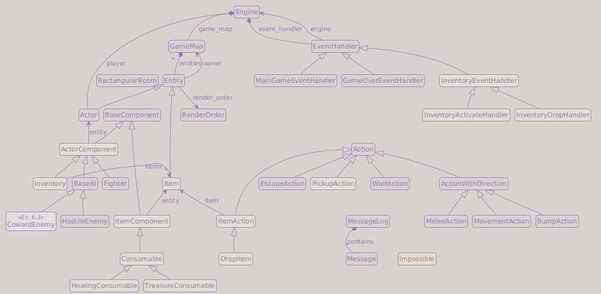

# Part 8: Items and Inventory

## What You Will Build

By the end of this part, the dungeon will contain items the player can pick up, carry in an inventory, use for healing, and drop back onto the map.

## Learning goals

- Add `Item` as a new entity class and `HealingConsumable` as its first component
- Give every entity an `owner` field so items know whether they are on the floor or in an inventory
- Add an `Inventory` component to actors and implement pickup, use, and drop actions
- Raise `Impossible` for action rejections that need player-facing feedback
- Build a letter-keyed inventory overlay using the modal handler pattern
- Spawn health potions in the dungeon

---

## Where does an item live?

Before writing any code, consider the central design question: a health potion needs to exist in two places.

When it is on the dungeon floor, the map owns it. When the player picks it up, the inventory owns it. It is the same Python object in both cases; only its *owner* changes. How does the game track which owner currently holds it?

The answer is an `owner` field on `Entity`. Every entity stores a reference to its current owner:

```txt
On the dungeon floor:
  Item
  └── owner = GameMap

In the player's inventory:
  Item
  └── owner = Inventory
```

In both cases the item is the same Python object, only `owner` changes. The field is the single source of truth for where an entity is: on the floor or in an inventory.

This chapter also introduces a second architectural change: **important action rejections should say why**. The old approach was to return silently (or return `None`). The new approach raises an `Impossible` exception for cases where the player needs feedback, with the reason as its message. A single `try/except` in the event handler intercepts every `Impossible` rejection and shows it in the message log.

---

## `game/exceptions.py`

Create a new file:

```python
from __future__ import annotations


class Impossible(Exception):
    """Exception raised when an action is impossible. The reason is the exception message."""
```

!!! info "Exceptions as control flow"
    Python uses exceptions for unexpected bugs, but also for *expected* failures: requesting an impossible action, reading past the end of a file, looking up a missing key. Raising `Impossible` is not a bug, it is a structured way to carry a rejection reason out of any call depth without threading a return value through every intermediate function.

Compare the alternatives. Returning `None` is silent: the caller has to check for it and decide what to tell the player. Returning a `bool` is only marginally better: the caller knows the action failed, but not why. Raising `Impossible("Your inventory is full.")` gives the reason for free, and a single `except Impossible as ex:` in the event handler catches every `Impossible` case with `str(ex)`.

---

## New constants

Two new visual elements arrive in this chapter: the health potion sprite and colors for item messages. Add them to the constants files.

In `game/constants/sprites.py`:

```diff
 CHEST   = "$"
 CORPSE  = "%"
+
+# Items
+HEALTH_POTION = "!"
```

In `game/constants/colors.py`, add an item color and two new message colors. Place the item color in the entity colors section (after `CORPSE`), and the message colors near the other UI colors:

```diff
 CORPSE        = (191,   0,   0)
+
+# Item colors
+HEALTH_POTION = (127, 0, 255)
```

```diff
 ENEMY_DEATH      = (0xFF, 0xA0, 0x30)
+HEALTH_RECOVERED = (0x00, 0xFF, 0x00)
```

```diff
 WELCOME_TEXT = (0x20, 0xA0, 0xFF)
 ...
+INVALID      = (0xFF, 0xFF, 0x00)
+
+# Inventory overlay colors
+INVENTORY_USE_FG  = (132, 198, 140)
+INVENTORY_USE_BG  = ( 16,  99,  27)
+INVENTORY_DROP_FG = (192, 128, 255)
+INVENTORY_DROP_BG = (128,   0, 255)
```

`HEALTH_RECOVERED` is bright green for HP-restore messages. `INVALID` is yellow for action-rejection messages. The four inventory constants define the foreground (border and text) and background colors for the two overlays: green for "use item", purple for "drop item".

---

## Narrowing component types

Every component in `game/entities/components/base_component.py` declares `entity: Entity`. That annotation is incorrect. A `Fighter` component's entity is always an `Actor`, it will never be a plain `Entity` or an `Item`. Once this chapter moves `ai` off `Entity`, `entity: Entity` no longer describes the design accurately: `self.entity.ai` and `self.entity.is_alive` are `Actor` attributes, and `Entity` does not declare them.

!!! question "What do we gain by narrowing?"
    After `ai` moves to `Actor`, the annotation `entity: Entity` is incomplete: `Entity` does not have `ai`, but `Fighter` accesses `self.entity.ai`. The attribute exists at runtime because `Fighter` is always attached to an `Actor`, but the declared type does not capture that invariant. Narrowing to `entity: Actor` makes the annotation accurate, and a type checker can verify the access correctly as a result.

By introducing `ActorComponent` (where `entity: Actor`) and `ItemComponent` (where `entity: Item`), we make the annotations correct: certain components are *always* actor components, others are *always* item components. The annotation narrows from `Entity` to the actual runtime type, so the declared type finally matches the design.

Update `game/entities/components/base_component.py`:

```diff
 from __future__ import annotations

 from typing import TYPE_CHECKING

 if TYPE_CHECKING:
-    from game.entities.entity import Entity
+    from game.entities.entity import Actor, Item


 class BaseComponent:
-    entity: Entity  # set by the owning Entity after creation
+    pass


+class ActorComponent(BaseComponent):
+    entity: Actor
+
+
+class ItemComponent(BaseComponent):
+    entity: Item
```

!!! info "Why keep `BaseComponent` at all?"
    `BaseComponent` has no `entity` annotation because the type of `entity` depends on whether the component belongs to an `Actor` or an `Item`: it is not meaningful at this level. `ActorComponent` and `ItemComponent` carry the correct declarations. `BaseComponent` is kept as their common ancestor in case future code needs to refer to "any component" generically (a debug inspector, a serialization layer, or a plugin system). If your project never needs that, you can remove `BaseComponent` entirely and make `ActorComponent` and `ItemComponent` independent classes.

Now update each existing component to use the correct base class. In `game/entities/components/fighter.py`:

```diff
-from game.entities.components.base_component import BaseComponent
+from game.entities.components.base_component import ActorComponent

 ...

-class Fighter(BaseComponent):
+class Fighter(ActorComponent):
```

In `game/entities/components/ai.py`:

```diff
-from game.entities.components.base_component import BaseComponent
+from game.entities.components.base_component import ActorComponent

 ...

-class BaseAI(BaseComponent):
+class BaseAI(ActorComponent):
```

`ItemComponent` declares `entity: Item`, but `Item` does not exist yet in `entity.py`. Add a one-line stub now so the annotation refers to a real class from the start:

```diff
+class Item(Entity):
+    pass
```

Step 6 in the next section replaces this stub with the full implementation.

The two new components introduced in this chapter (`Inventory` and `Consumable`) will use the correct bases from the start.

---

## Updating `game/entities/entity.py`

`entity.py` changes in several steps. Each step introduces one concept before the next one depends on it.

### Step 1: Remove `ai` from `Entity` and expand TYPE_CHECKING imports

`ai` is an `Actor` concern, not an `Entity` concern. Plain entities (passive blockers, map decorations) never have AI. Keeping it on the base class was a holdover from before `Actor` existed.

At the same time, add the imports that the new classes and annotations in this chapter require:

```diff
 if TYPE_CHECKING:
     from game.entities.components.ai import BaseAI
+    from game.entities.components.consumable import Consumable
+    from game.entities.components.inventory import Inventory
     from game.map.game_map import GameMap


 class Entity:

     def __init__(
         self,
         x: int = 0,
         ...
         render_order: RenderOrder = RenderOrder.UNKNOWN,
-        ai: BaseAI | None = None,
     ) -> None:
         self.x               = x
         ...
         self.render_order    = render_order
-        self.ai              = ai
```

#### Step 2: Add the `owner` field

Add `owner` as the first parameter of `__init__`, and auto-register the entity when an owner is provided:

```diff
 class Entity:
+    owner: GameMap | Inventory | None
+
     def __init__(
         self,
+        owner: GameMap | None = None,
         x: int = 0,
         y: int = 0,
         ...
         render_order: RenderOrder = RenderOrder.UNKNOWN,
     ) -> None:
+        self.owner           = owner
         self.x               = x
         ...
         self.render_order    = render_order
+        if owner is not None:
+            owner.entities.add(self)
```

Every entity tracks its owner. The class-level annotation covers all values the field holds over its lifetime, while the `__init__` parameter is intentionally narrower.

!!! tip "Class-level annotation vs `__init__` parameter"
    Declare the field's full type at class level and use a narrower `__init__` parameter for the valid *initial* states only. The class-level annotation is authoritative: a type checker respects it and will not flag later reassignments to `Inventory`. This pattern is useful whenever an attribute can legitimately change type over its lifetime but only starts in a subset of those states.

The constructor parameter is `GameMap | None`: entities start on the map or unowned. Item *templates* (defined in `game/entities/factories.py`) are created with no owner. When `spawn()` places a clone on the floor, the clone gets `owner = dungeon`. When `PickupAction` picks it up, `item.owner` changes to `inventory`. The class-level annotation covers all three runtime states.

!!! info "The three ownership states"
    - **Template**: `entity.owner = None`

        `None` means the entity currently has no owner. At construction time, this is how factory templates are represented.

    - **On the map**: `entity.owner = GameMap`

        `GameMap` means it has just been spawned.

    - **In inventory**: `entity.owner = Inventory`

        `Inventory` is only set later, on pickup, so accepting it at construction time would be misleading.

### Step 3: Update `spawn()`

`spawn()` existed since Part 5. It creates a deep copy and adds it to the map's entity set. Now it also sets `owner` on the clone:

```diff
     def spawn(self, game_map: GameMap, x: int, y: int) -> Entity:
         clone = copy.deepcopy(self)
         clone.x     = x
         clone.y     = y
+        clone.owner = game_map
         game_map.entities.add(clone)
         return clone
```

### Step 4: Add `place()`

`place()` moves an entity to a new position and optionally transfers it to a new owner. The inventory `drop()` method calls it to return an item to the dungeon floor:

```diff
+    def place(self, x: int, y: int, game_map: GameMap | None = None) -> None:
+        from game.map.game_map import GameMap
+
+        self.x = x
+        self.y = y
+        if game_map is not None:
+            if self.owner is not None:
+                if isinstance(self.owner, GameMap):
+                    self.owner.entities.discard(self)
+
+            self.owner = game_map
+            game_map.entities.add(self)
+
     def set_position(self, x: int, y: int) -> None:
```

The local import makes `GameMap` available at runtime without introducing a module-level circular import. `self.owner is not None` guards against placing a fresh template entity for the first time. Once that check passes, `isinstance(self.owner, GameMap)` determines whether the entity is registered directly with the map and needs to be removed from it: items being dropped from inventory have `owner = Inventory`, so the isinstance check is `False` and the discard is skipped correctly.

### Step 5: Add `inventory` to `Actor` and fix the `ai` annotation

`Actor` now requires an `Inventory` component. This step also cleans up the `ai` wiring: since `Entity` no longer accepts `ai`, `Actor` must own the attribute directly.

Update `Actor.__init__`:

```diff
     def __init__(
         self,
         *,
         x: int    = 0,
         y: int    = 0,
         char: str = sprites.UNKNOWN,
         color: tuple[int, int, int] = colors.DEFAULT_FG,
         name: str = "<unnamed>",
         ai: BaseAI | None = None,
         fighter: Fighter,
+        inventory: Inventory,
     ) -> None:
         super().__init__(
             x               = x,
             y               = y,
             char            = char,
             color           = color,
             name            = name,
             blocks_movement = True,
             render_order    = RenderOrder.ACTOR,
-            ai              = ai,
         )
         self.fighter = fighter
         self.fighter.entity = self

-        if self.ai:
-            self.ai.entity = self
+        self.inventory = inventory
+        self.inventory.entity = self
+
+        self.ai = ai
+        if self.ai is not None:
+            self.ai.entity = self
```

`ai=ai` is no longer passed to `super().__init__()` because `Entity` no longer accepts it.

### Step 6: Add the `Item` class

`Item` is parallel to `Actor`: a specialised entity with its own required component. Replace the stub with the full class:

```diff
-class Item(Entity):
-    pass
+class Item(Entity):
+
+    def __init__(
+        self,
+        *,
+        x: int = 0,
+        y: int = 0,
+        char: str = sprites.UNKNOWN,
+        color: tuple[int, int, int] = colors.DEFAULT_FG,
+        name: str = "<unnamed>",
+        consumable: Consumable,
+    ) -> None:
+        super().__init__(
+            x=x,
+            y=y,
+            char=char,
+            color=color,
+            name=name,
+            blocks_movement=False,
+            render_order=RenderOrder.ITEM,
+        )
+        self.consumable = consumable
+        self.consumable.entity = self
```

Items do not usually block movement (you can stand on top of a potion) and render at `RenderOrder.ITEM`, below actors and above the floor.

---

## Add `items` to `GameMap`

`PickupAction` needs to iterate over items on the map. Add a filtered property to `game/map/game_map.py`:

```diff
 if TYPE_CHECKING:
-    from game.entities.entity import Actor, Entity
+    from game.entities.entity import Actor, Entity, Item

 ...

     @property
     def actors(self) -> Iterator[Actor]:
         ...

+    @property
+    def items(self) -> Iterator[Item]:
+        from game.entities.entity import Item
+
+        yield from (e for e in self.entities if isinstance(e, Item))
```

---

## Create `game/entities/components/inventory.py`

```python
from __future__ import annotations

from typing import TYPE_CHECKING

from game.entities.components.base_component import ActorComponent

if TYPE_CHECKING:
    from game.entities.entity import Item
    from game.map.game_map import GameMap


class Inventory(ActorComponent):

    def __init__(self, capacity: int) -> None:
        self.capacity = capacity
        self.items: list[Item] = []

    def add_item(self, item: Item, game_map: GameMap | None) -> bool:
        if len(self.items) >= self.capacity:
            return False

        if game_map is not None:
            game_map.entities.discard(item)

        item.owner = self
        self.items.append(item)

        return True

    def drop_item(self, item: Item, game_map: GameMap) -> None:
        self.items.remove(item)
        item.place(self.entity.x, self.entity.y, game_map)
```

`add_item()` checks capacity, transfers ownership to the inventory, and appends the item to `items`. When the item comes from the dungeon floor, the caller passes the current `game_map`, and `add_item()` removes it from the map's entity set via `game_map.entities.discard()`. When the item was never placed on a map, for example a debug starting item, the caller can pass `None`.

`game_map` accepts `None`, but it does not have a default value. This makes each call state its intent explicitly: `inventory.add_item(item, engine.game_map)` means "take this item from the map", while `inventory.add_item(item, None)` means "add an item that is not on any map". That explicit argument helps avoid accidentally leaving a floor item both in the map and in the inventory. The method returns `False` if the inventory is full so that the caller can raise `Impossible` with a reason.

`drop_item()` removes the item from `items`, then calls `item.place()` to move it back to the dungeon floor at the actor's current position. The caller passes `game_map` explicitly: `DropItem.perform` already has `engine` and can supply `engine.game_map` directly, so `Inventory` does not need to navigate the ownership chain itself.

---

## Create `game/entities/components/consumable.py`

```python
from __future__ import annotations

from typing import TYPE_CHECKING

from game.entities.components.base_component import ItemComponent
from game.constants import colors
from game.exceptions import Impossible
from game.message_log import MessageLog

if TYPE_CHECKING:
    from game.actions import Action, ItemAction
    from game.engine import Engine
    from game.entities.entity import Actor


class Consumable(ItemComponent):

    def get_action(self, _consumer: Actor, _engine: Engine) -> Action | None:
        """Return the action this consumable produces when used."""
        from game.actions import ItemAction

        return ItemAction(item=self.entity)

    def activate(self, _action: ItemAction, _engine: Engine, _consumer: Actor) -> None:
        """Apply this consumable's effect. Must be overridden."""
        raise NotImplementedError()

    def consume(self) -> None:
        """Remove the item from the holder's inventory."""
        from game.entities.components.inventory import Inventory

        entity = self.entity
        inventory = entity.owner
        if isinstance(inventory, Inventory) and entity in inventory.items:
            inventory.items.remove(entity)
            entity.owner = None


class HealingConsumable(Consumable):

    def __init__(self, amount: int) -> None:
        self.amount = amount

    def activate(self, _action: ItemAction, _engine: Engine, consumer: Actor) -> None:
        amount_recovered = consumer.fighter.heal(self.amount)

        if amount_recovered > 0:
            MessageLog.add_message(
                f"You consume the {self.entity.name}, and recover {amount_recovered} HP!",
                colors.HEALTH_RECOVERED,
            )
            self.consume()

        else:
            raise Impossible("Your health is already full.")
```

The file defines `Consumable` as the base class for all item effects and `HealingConsumable` as its first concrete subclass.

`Consumable.get_action()` returns the action produced by using this item. In this chapter it returns a plain `ItemAction`, but future consumable types can override it to request additional input before acting, for example a targeting scroll that needs a destination tile.

`consume()` imports `Inventory` locally to avoid a circular import: `consumable.py` and `inventory.py` would otherwise form a cycle at module level. The `isinstance` check serves double duty: it guards against consuming an unowned item and narrows the declared type from `GameMap | Inventory | None` to `Inventory`, making the subsequent `inventory.items` access well-typed. After removing the item, `entity.owner = None` clears the stale reference so the consumed item no longer points at the inventory it came from.

`HealingConsumable.activate()` calls `fighter.heal()`, which you wrote in Part 7. If the player is already at full health, `heal()` returns `0` and `activate()` raises `Impossible`. The event handler will catch it and show the reason as a yellow message.

---

## Update `game/entities/factories.py`

Every `Actor` now requires an `Inventory`. Add the component to the existing templates:

```diff
 from game.entities.components.ai import HostileEnemy
+from game.entities.components.consumable import HealingConsumable
 from game.entities.components.fighter import Fighter
+from game.entities.components.inventory import Inventory
 from game.constants import colors, sprites
-from game.entities.entity import Actor, Entity
+from game.entities.entity import Actor, Entity, Item
```

```diff
 player = Actor(
     char      = sprites.PLAYER,
     color     = colors.PLAYER,
     name      = "Player",
     ai        = None,
     fighter   = Fighter(hp=30, defense=2, attack=5),
+    inventory = Inventory(capacity=10),
 )

 orc = Actor(
     char      = sprites.ORC,
     color     = colors.ORC,
     name      = "Orc",
     ai        = HostileEnemy(),
     fighter   = Fighter(hp=10, defense=0, attack=3),
+    inventory = Inventory(capacity=0),
 )

 troll = Actor(
     char      = sprites.TROLL,
     color     = colors.TROLL,
     name      = "Troll",
     ai        = HostileEnemy(),
     fighter   = Fighter(hp=16, defense=1, attack=4),
+    inventory = Inventory(capacity=0),
 )
```

The player starts with `capacity=10`. 10 makes a full inventory a real constraint worth managing. Enemies get `capacity=0`: their inventory exists (so the type is satisfied) but they cannot hold any items. An orc that walks over a potion will not pick it up.

Then add the health potion template and the spawn table at the bottom of the file:

```python
# Items
health_potion = Item(
    char       = sprites.HEALTH_POTION,
    color      = colors.HEALTH_POTION,
    name       = "Health Potion",
    consumable = HealingConsumable(amount=4),
)

chest = Entity(
    char            = sprites.CHEST,
    color           = colors.CHEST,
    name            = "Chest",
    blocks_movement = True,
)

item_chances = [
    (health_potion, 40),
    (chest,         60),
]
```

`item_chances` mirrors the `monster_chances` pattern from Part 5: a list of `(template, weight)` pairs that `map_generator.py` will use to pick which item to place in each room. Weights are relative: a chest (60) is created more often than a potion (40). Exercise 2 adds `backpack_scroll` to this list.

---

## Update `game/actions.py`

Add the three new action classes and two new imports at the top of the file:

```diff
+from game.entities.entity import Actor, Item
+from game.exceptions import Impossible
 from game.message_log import MessageLog
```

```python
class PickupAction(Action):

    def perform(self, engine: Engine, entity: Entity) -> None:
        assert isinstance(entity, Actor)
        inventory = entity.inventory

        for item in engine.game_map.items:
            if entity.x == item.x and entity.y == item.y:
                if not inventory.add_item(item, game_map=engine.game_map):
                    raise Impossible("Your inventory is full.")

                MessageLog.add_message(f"You picked up the {item.name}!")
                return

        raise Impossible("There is nothing here to pick up.")


class ItemAction(Action):

    def __init__(self, item: Item) -> None:
        super().__init__()
        self.item = item

    def perform(self, engine: Engine, entity: Entity) -> None:
        assert isinstance(entity, Actor)
        self.item.consumable.activate(self, engine, entity)


class DropItem(ItemAction):

    def perform(self, engine: Engine, entity: Entity) -> None:
        assert isinstance(entity, Actor)
        entity.inventory.drop_item(self.item, engine.game_map)
        MessageLog.add_message(f"You dropped the {self.item.name}.")
```

`PickupAction` iterates `engine.game_map.items` (the new property) looking for an item at the player's position. If found, it delegates to `inventory.add_item()`, which removes the item from the map's entity set, transfers ownership to the inventory, and appends it to `inventory.items`. Both trailing `raise Impossible` statements ensure the player always gets feedback.

`ItemAction` delegates to `consumable.activate()`. `DropItem` extends `ItemAction` because dropping also needs the item reference, but calls `inventory.drop_item()` instead.

The `assert isinstance(entity, Actor)` calls enforce a design contract: `Action.perform` is declared with `entity: Entity`, but these three actions require an `Actor` (only actors have `inventory`). The asserts make that constraint explicit at runtime and narrow the declared type, so a type checker can verify the subsequent attribute accesses without casts.

Since `Actor` is now imported at the top of the file, remove the local import that was inside `MeleeAction.perform()`:

```diff
-        from game.entities.entity import Actor
-
         if not isinstance(entity, Actor):
```

Also add `PickupAction` to the import list at the top of `game/input_handlers.py`:

```diff
-from game.actions import (
-    Action,
-    BumpAction,
-    EscapeAction,
-    WaitAction,
-)
+from game.actions import (
+    Action,
+    BumpAction,
+    EscapeAction,
+    PickupAction,
+    WaitAction,
+)
```

---

## Move action execution into `EventHandler`

So far `Engine.handle_events()` ran the action returned by the event handler. That worked when there was only one handler, but modal handlers (the inventory overlay) need to switch the active handler *after* an action completes. Only the handler knows which handler it should return to; the engine does not.

!!! info "Why move execution into the handler?"
    `Engine.handle_events()` currently does: get action from handler, perform it, run enemy turns, update FOV. That is fine with one handler. But when the inventory overlay is open, pressing `a` should use the item *and then close the overlay* (returning to `MainGameEventHandler`). The engine cannot make that switch because it does not know which handler to return to. The handler does: it opened the overlay, so it knows to close it.

    Moving the execution loop into `EventHandler.handle_events()` gives each handler control over what happens after an action.

Update `game/engine.py`. The `handle_events` signature changes from `Iterable[Any]` to `Iterable[tcod.event.Event]`, so `Any` is no longer needed. `GameOverEventHandler` also moves out of `engine.py` (it is now referenced from inside `EventHandler.handle_events` in `input_handlers.py`):

```diff
-from typing import Any

 import tcod.event
 ...
-from game.input_handlers import (
-    EventHandler,
-    GameOverEventHandler,
-    MainGameEventHandler
-)
+from game.input_handlers import EventHandler, MainGameEventHandler
```

Then simplify `handle_events()` to a one-line dispatch:

```diff
-def handle_events(self, events) -> None:
+def handle_events(self, events: Iterable[tcod.event.Event]) -> None:
     for event in events:
-        action = self.event_handler.handle_events(event)
-        if action is not None:
-            action.perform(self, self.player)
-            self.handle_enemy_turns()
-            self.update_fov()
+        self.event_handler.handle_events(event)
```

Now rewrite `EventHandler.handle_events()` in `game/input_handlers.py` to own the full execution cycle. `from game.constants import colors` was already imported in Part 7; only `Impossible` is new:

```diff
+from game.exceptions import Impossible
 from game.message_log import MessageLog
```

```python
def handle_events(self, event: tcod.event.Event) -> None:
    action: Action | None = None

    match event:
        case tcod.event.Quit():
            action = EscapeAction()

        case tcod.event.MouseMotion():
            self.engine.mouse_location = event.integer_position

        case tcod.event.KeyDown():
            action = self.event_keydown(event)

    if action is not None:
        try:
            action.perform(self.engine, self.engine.player)

        except Impossible as ex:
            MessageLog.add_message(str(ex), colors.INVALID)
            return

        if self.engine.player.is_alive:
            self.engine.handle_enemy_turns()

        if not self.engine.player.is_alive:
            self.engine.event_handler = GameOverEventHandler(self.engine)

        elif isinstance(self.engine.event_handler, (InventoryActivateHandler, InventoryDropHandler)):
            self.engine.event_handler = MainGameEventHandler(self.engine)

        self.engine.update_fov()
```

Key differences from the old engine code:

- `except Impossible as ex:` catches any rejection, logs it with `colors.INVALID`, and returns early so enemies do not take their turn on a failed action.
- After a successful action, if the current handler is an inventory handler, it switches back to `MainGameEventHandler`. Opening the inventory does not advance time; using or dropping an item does.

!!! note "What Impossible is for"
    `Impossible` is reserved for rejections that are worth telling the player about: a full inventory, an already-healed condition, nothing to pick up. Low-level movement failures (bumping into a wall, trying to walk off the map) are not raised as `Impossible`. Those actions still cost a turn (the player pressed a key and something was attempted), but generating a log message for every wall collision would be noise. The convention is: if the player needs to read why an action failed, raise `Impossible`; if the failure is self-evident from the game state, return silently.

The return type of `handle_events` changes from `Action | None` to `None`. Update the method signature line accordingly.

---

## Trim movement keys

Vi keys (`b`, `h`, `j`, `k`, `l`, `n`, `u`, `y`) have been part of roguelikes since the original *Rogue* (1980), which ran on VT100 terminals with no arrow keys. On a modern keyboard, arrow keys and the numpad cover the same directions with less ambiguity, and freeing those letters matters here: this chapter adds `G`, `I`, and `D` as action keys, and Exercise 3 assigns the remaining letters to items for direct use from the map.

Remove the vi keys block from `MOVE_KEYS` in `game/input_handlers.py`:

```diff
-    # Vi keys
-    tcod.event.KeySym.B:     (-1,  1),
-    tcod.event.KeySym.J:     ( 0,  1),
-    tcod.event.KeySym.N:     ( 1,  1),
-    tcod.event.KeySym.H:     (-1,  0),
-    tcod.event.KeySym.L:     ( 1,  0),
-    tcod.event.KeySym.Y:     (-1, -1),
-    tcod.event.KeySym.K:     ( 0, -1),
-    tcod.event.KeySym.U:     ( 1, -1),
```

!!! info "Numpad vs. regular number keys"
    `tcod.event.KeySym.KP_1`–`KP_9` are distinct key codes from `tcod.event.KeySym.K_1`–`K_9`. Numpad keys continue to work for movement. Regular number keys (`1`–`9`, `0`) remain free for future use, such as equipment slots in Part 13.

---

## Update `MainGameEventHandler`

Add three key bindings at the end of `event_keydown`:

```diff
         if key == tcod.event.KeySym.ESCAPE:
             return EscapeAction()

+        if key == tcod.event.KeySym.G:
+            return PickupAction()
+
+        if key == tcod.event.KeySym.I:
+            self.engine.event_handler = InventoryActivateHandler(self.engine)
+
+        if key == tcod.event.KeySym.D:
+            self.engine.event_handler = InventoryDropHandler(self.engine)
+
         return None
```

`G` returns a `PickupAction`; the action system handles the rest. `I` and `D` do not return actions; they switch the active handler immediately. The overlay then handles the next key press.

---

## Inventory handlers

Three new handler classes go at the bottom of `game/input_handlers.py`.

!!! tip "Modal handlers"
    An inventory handler follows exactly the same pattern as `GameOverEventHandler` from Part 7: it overrides `on_render()` to draw an overlay on top of the map, and `event_keydown()` to handle its own key set. The overlay closes when the player selects a valid item (an action executes, then `EventHandler.handle_events` switches back to `MainGameEventHandler`) or presses `Escape` (handled explicitly in `event_keydown`, which sets the handler directly without returning an action). Any other unrecognised key does nothing. This pattern composes cleanly: any handler can open any other handler, and the "stack" is simply `self.engine.event_handler` with no handler stack to maintain.

```python
class InventoryEventHandler(EventHandler):
    """Base class for inventory screens (use and drop share the same UI)."""

    TITLE    = "<missing title>"
    FG_COLOR = colors.WHITE
    BG_COLOR = colors.BLACK

    def on_render(self, console: tcod.Console) -> None:
        super().on_render(console)  # draws the map behind the overlay

        inventory = self.engine.player.inventory
        number_of_items_in_inventory = len(inventory.items)

        height = min(max(3, number_of_items_in_inventory + 2), console.height - 2)

        item_width = max((len(item.name) for item in inventory.items), default=0) + 8
        width  = max(len(self.TITLE) + 4, item_width)
        x = (console.width  - width)  // 2
        y = (console.height - height) // 2

        # Fills the entire window with the inventory background color
        console.draw_rect(
            x        = x,
            y        = y,
            width    = width,
            height   = height,
            ch       = ord(' '),
            fg       = self.FG_COLOR,
            bg       = self.BG_COLOR,
            bg_blend = tcod.constants.BKGND_SET,
        )

        # Draws only the frame and title, leaving the previous fill intact
        console.draw_frame(
            x      = x,
            y      = y,
            width  = width,
            height = height,
            title  = self.TITLE,
            clear  = False,
            fg     = self.FG_COLOR,
            bg     = self.BG_COLOR,
        )

        if number_of_items_in_inventory > 0:
            for i, item in enumerate(inventory.items[:height - 2]):
                item_key = chr(ord("a") + i)
                console.print(x + 1, y + i + 1, f"({item_key}) ")
                console.print(x + 5, y + i + 1, item.char, fg=item.color)
                console.print(x + 7, y + i + 1, item.name)

        else:
            console.print(x + 1, y + 1, "(Empty)")

    def event_keydown(self, event: tcod.event.KeyDown) -> Action | None:
        player = self.engine.player
        key = event.sym
        index = key - tcod.event.KeySym.A

        if 0 <= index <= 25:
            try:
                selected_item = player.inventory.items[index]
            except IndexError:
                MessageLog.add_message("Invalid entry.", colors.INVALID)
                return None

            return self.on_item_selected(selected_item)

        if key == tcod.event.KeySym.ESCAPE:
            self.engine.event_handler = MainGameEventHandler(self.engine)
            return None

        return super().event_keydown(event)

    def on_item_selected(self, item: Item) -> Action | None:
        raise NotImplementedError()


class InventoryActivateHandler(InventoryEventHandler):
    TITLE    = "Select an item to use"
    FG_COLOR = colors.INVENTORY_USE_FG
    BG_COLOR = colors.INVENTORY_USE_BG

    def on_item_selected(self, item: Item) -> Action | None:
        return item.consumable.get_action(self.engine.player, self.engine)


class InventoryDropHandler(InventoryEventHandler):
    TITLE    = "Select an item to drop"
    FG_COLOR = colors.INVENTORY_DROP_FG
    BG_COLOR = colors.INVENTORY_DROP_BG

    def on_item_selected(self, item: Item) -> Action | None:
        from game.actions import DropItem

        return DropItem(item=item)
```

`on_render()` renders the map first via `super()`, then draws the overlay in two passes.

The first pass is `console.draw_rect()` with `bg_blend=tcod.constants.BKGND_SET`. The SET blend mode writes the background color directly, producing an opaque fill. `ch=ord(' ')` replaces every character cell in the rectangle with a space, so the map tiles underneath are fully hidden. `fg=self.FG_COLOR` sets the foreground color on those cells as well, so the text printed on top inherits the right color from the start.

The second pass is `console.draw_frame()` with `clear=False`. Because `draw_rect` already set the background, `clear=False` tells `draw_frame` to draw only the border characters without overwriting the interior. `fg=self.FG_COLOR` colors the border; `bg=self.BG_COLOR` sets the border cells' background to match.

Each item line is printed in three pieces: the letter key at `x+1` (e.g. `(a)`), the item sprite in its own color at `x+5`, and the name at `x+7`. This separates the selection key from the item's visual identity and lets the sprite color stand out. The frame width is calculated to fit the longest item name: `len(name) + 8` accounts for the 7 prefix characters (key, space, sprite, space) plus 1 for a trailing margin.

`TITLE`, `FG_COLOR`, and `BG_COLOR` follow the same class-variable pattern introduced in Part 7 for `GameOverEventHandler`. Each subclass overrides them: green tones for activation, purple tones for dropping, so the player always knows which overlay is open at a glance.

`event_keydown()` converts the pressed key to an index: `a → 0`, `b → 1`, and so on. The range `0 <= index <= 25` covers exactly the 26 letters `a`-`z`. If the index falls outside the item list, it logs "Invalid entry." and returns `None`. Otherwise it calls `on_item_selected()`, which the two subclasses implement differently. `Escape` closes the overlay immediately by switching back to `MainGameEventHandler` without returning an action (so enemies do not take a turn).

`InventoryActivateHandler` asks the item's consumable for an action; `InventoryDropHandler` returns a `DropItem`. The action is then executed by `EventHandler.handle_events()` and, because the current handler is an inventory handler, the handler automatically switches back to `MainGameEventHandler` after the action completes.

You will notice that `InventoryActivateHandler` and `InventoryDropHandler` are referenced in `EventHandler.handle_events()`, which is defined earlier in the same file. This is fine in Python: method bodies are only executed when called, at which point all classes in the module are already defined.

Also add `Item` to the imports at the top of `input_handlers.py` so that `on_item_selected` can use it as a type annotation:

```diff
 if TYPE_CHECKING:
     from game.engine import Engine
+    from game.entities.entity import Item
```

---

## Update `game/map/map_generator.py`

In Part 5, `place_entities` accepted a single monster limit. Part 8 adds **item** spawning, so the function receives both monster and item limits.

!!! tip "If you completed Exercise 1 from Part 5"
    That exercise added `min_monsters` to `place_entities`. The diffs below assume it is already there. If you skipped it, add `min_monsters: int` alongside `max_monsters` and replace `max_monsters` with `random.randint(min_monsters, max_monsters)` while you are here.

!!! tip "If you skipped Exercise 2 from Part 5"
    The monster loop below assumes the weighted table from that exercise: `factories.monster_chances`, split into `monster_templates` and `monster_weights`, then selected with `random.choices`. If your code still has a hardcoded orc/troll `if/else`, replace it with the `random.choices` version here. It is the version future spawn tables build on.

Expand the function signature:

```diff
 def place_entities(
     room: RectangularRoom,
     dungeon: GameMap,
     min_monsters: int,
     max_monsters: int,
+    min_items: int,
+    max_items: int,
 ) -> None:
     number_of_monsters = random.randint(min_monsters, max_monsters)
+    number_of_items    = random.randint(min_items, max_items)
```

Then add the item spawning loop at the end of the function body. The diff also renames the `monster` variable to `monsters` and moves the `[0]` index onto its own line so the comment reads on its own line:

```diff
        if not any(entity.x == x and entity.y == y for entity in dungeon.entities):
-            monster = random.choices(
+            monsters = random.choices(
                 monster_templates,
                 weights=monster_weights,
-                k=1,
-            )[0]
-            monster.spawn(dungeon, x, y)
+                k=1,
+            )
+            # First element (because random.choices returns a list)
+            monsters[0].spawn(dungeon, x, y)
+
+    for _ in range(number_of_items):
+        x = random.randint(room.x1 + 1, room.x2 - 1)
+        y = random.randint(room.y1 + 1, room.y2 - 1)
+        if not any(entity.x == x and entity.y == y for entity in dungeon.entities):
+            factories.health_potion.spawn(dungeon, x, y)
```

Also expand the signature of `generate_dungeon` itself to accept the item parameters:

```diff
 def generate_dungeon(
     max_rooms: int,
     room_min_size: int,
     room_max_size: int,
     map_width: int,
     map_height: int,
     min_monsters_per_room: int,
     max_monsters_per_room: int,
+    min_items_per_room: int,
+    max_items_per_room: int,
     player: Entity,
 ) -> GameMap:
```

While in `generate_dungeon`, update the first-room branch to use `place()` instead of `set_position()`:

```diff
         if not rooms:
-            player.set_position(*new_room.center)
+            player.place(*new_room.center, dungeon)
```

`place()` sets `player.owner = dungeon`. Without this, the player would be present in `dungeon.entities` but still have `owner = None`, which would make the ownership state inconsistent from the first map onward.

Update the call site in `generate_dungeon`:

```diff
             place_entities(
                 new_room,
                 dungeon,
                 min_monsters_per_room,
                 max_monsters_per_room,
+                min_items_per_room,
+                max_items_per_room,
             )
```

---

## Update `main.py`

Add the item density parameters alongside the monster parameters:

```diff
     min_monsters_per_room = 0
     max_monsters_per_room = 2
+    min_items_per_room    = 0
+    max_items_per_room    = 2
```

Pass them to `generate_dungeon`:

```diff
     game_map = generate_dungeon(
         ...
         min_monsters_per_room = min_monsters_per_room,
         max_monsters_per_room = max_monsters_per_room,
+        min_items_per_room    = min_items_per_room,
+        max_items_per_room    = max_items_per_room,
         player                = player,
     )
```

---

## Treasure chests

The chest introduced in Part 5 has been blocking movement without doing anything useful. Now that `Item` and `Consumable` exist, the chest can become a collectible that rewards the player with gold.

### New color constant

In `game/constants/colors.py`:

```diff
 INVALID = (0xFF, 0xFF, 0x00)
+GOLD    = (0xFF, 0xD7, 0x00)
```

### `TreasureConsumable`

Add a new consumable class in `game/entities/components/consumable.py`. It differs from `HealingConsumable` in one important way: the item is never added to the inventory. It is collected directly from the floor and disappears immediately. Add a class-level flag to mark this behavior, and override it:

```diff
 class Consumable(ItemComponent):
+    auto_collect: bool = False
```

```python
class TreasureConsumable(Consumable):
    auto_collect = True

    def __init__(self, value: int) -> None:
        self.value = value

    def activate(self, _action: ItemAction, engine: Engine, consumer: Actor) -> None:
        consumer.gold += self.value
        MessageLog.add_message(
            f"You found {self.value} gold!",
            colors.GOLD,
        )
        engine.game_map.entities.discard(self.entity)
        self.entity.owner = None
```

`activate()` adds `value` to `consumer.gold`, logs the find, and removes the chest from the map in the same call. There is no `self.consume()` here because `consume()` removes an item from an inventory; the chest was never in one.

### `gold` field on `Actor`

Add `self.gold = 0` at the end of `Actor.__init__`. It sits alongside `inventory` and `ai` as a first-class actor attribute, readable anywhere as `actor.gold`:

```diff
         self.ai: BaseAI | None = ai
         if self.ai:
             self.ai.entity = self
+
+        self.gold = 0
```

### Convert `chest` in `factories.py`

Replace the passive `Entity` with an `Item`:

```diff
-chest = Entity(
-    char            = sprites.CHEST,
-    color           = colors.CHEST,
-    name            = "Chest",
-    blocks_movement = True,
-)
+chest = Item(
+    char       = sprites.CHEST,
+    color      = colors.CHEST,
+    name       = "Chest",
+    consumable = TreasureConsumable(value=10),
+)
```

The chest no longer blocks movement (items never block movement). The player walks over it to collect it.

### Auto-collect in `MovementAction`

`PickupAction` is triggered by the `G` key. Treasure should also be collected automatically when the player steps on it. After `entity.move()` in `MovementAction.perform()`, scan the new tile for auto-collect items:

```diff
         entity.move(self.dx, self.dy)
+
+        # Auto-collect items that are picked up on contact (player only)
+        if entity is engine.player:
+            for item in list(engine.game_map.items):
+                if item.x == entity.x and item.y == entity.y and item.consumable.auto_collect:
+                    ItemAction(item=item).perform(engine, entity)
```

The guard is `entity is engine.player`, not `isinstance(entity, Actor)`: enemy movement also goes through `MovementAction`, so without this check an orc or troll that walks onto a chest would collect it and trigger "You found 10 gold!". `list(engine.game_map.items)` creates a snapshot before iterating because `activate()` modifies `game_map.entities` during the loop.

### `render_gold` in `hud.py`

Add a one-line gold display below the HP bar:

```python
def render_gold(
    console: Console,
    gold: int,
    y: int = 44,
) -> None:
    console.print(x=0, y=y, text=f"$ {gold}", fg=colors.GOLD)
```

Call it from `Engine.render()`:

```diff
     hud.render_bar(...)
+
+    hud.render_gold(
+        console = console,
+        gold    = self.player.gold,
+    )
```

---

## Testing your work

Run the game and verify the following:

- Health potions (`!`) appear on the dungeon floor in most rooms.
- Walking over a potion and pressing `G` adds it to the inventory and shows "You picked up the Health Potion!".
- Pressing `G` on an empty tile shows "There is nothing here to pick up." in yellow.
- Pressing `I` opens the "Select an item to use" overlay and lists carried items by letter.
- Pressing the letter for a potion when injured heals the player and shows a green message.
- Pressing the letter for a potion at full health shows "Your health is already full." in yellow.
- Pressing `D` opens the "Select an item to drop" overlay; selecting an item drops it at the player's feet.
- Pressing an out-of-range letter in the inventory overlay shows "Invalid entry." in yellow.
- Enemies still act on their turn after the player successfully uses or drops an item.
- Enemies do *not* act when the player tries to pick up from an empty tile (a failed action costs no turn).
- Chests (`$`) appear on the dungeon floor. Walking over one shows "You found 10 gold!" and the `$` symbol disappears.
- The gold counter below the HP bar increments each time a chest is collected.

---

## Summary

Items are now a first-class part of the game. Key additions:

- **`game/exceptions.py`**: `Impossible` exception carries a rejection reason; one `except` in `handle_events` covers every case
- **`ActorComponent` / `ItemComponent`**: narrowed base classes so type annotations match the actual runtime type
- **`Entity.owner`**: single source of truth for whether an entity is on the floor or in an inventory
- **`Item` / `Inventory`**: new entity subclass and actor component; pickup, use, and drop are modelled as actions
- **`HealingConsumable`**: first consumable component; knows how to apply its effect independently of the action layer
- **`TreasureConsumable`**: second consumable; collected on contact rather than through the inventory; `auto_collect = True` triggers pickup on walk
- **`InventoryEventHandler`**: modal overlay base class; subclasses override `TITLE`, `FG_COLOR`, `BG_COLOR`, and `on_item_selected()`
- **`Actor.gold`**: running treasure total on the actor itself (not in `Fighter`); displayed in the HUD below the HP bar

**Current architecture**:

- `Entity.owner`: set to `GameMap` on spawn, changed to `Inventory` on pickup, back to `GameMap` on drop; never `None` while the entity is alive
- `Inventory`: component on `Actor`; holds items up to `capacity`, enforces the limit, and handles drop logic
- `Consumable.auto_collect`: class-level flag; `MovementAction` checks it after every step and activates any matching item on the tile
- `HealingConsumable.activate()`: applies healing and calls `self.consume()` to remove the item from inventory
- `TreasureConsumable.activate()`: adds gold, logs the message, and removes the item from the map directly; it never enters inventory
- `Impossible`: raised anywhere in the action chain; `handle_events` catches it and shows the message in the log
- `InventoryEventHandler`: subclasses provide `on_item_selected()` and override the three class variables; `EventHandler.handle_events()` automatically switches back to `MainGameEventHandler` after an inventory action
- `ActorComponent` / `ItemComponent`: `entity` annotation narrows from `Entity` to the actual holder type, so type checkers can verify component attribute access correctly

**Class Diagram**:



**File structure**:

```txt
main.py                         ← modified
game/
├── __init__.py
├── actions.py                  ← modified
├── engine.py                   ← modified
├── exceptions.py               ← new
├── hud.py                      ← modified
├── input_handlers.py           ← modified
├── message_log.py
├── constants/
│   ├── __init__.py
│   ├── colors.py               ← modified
│   └── sprites.py              ← modified
├── entities/
│   ├── __init__.py
│   ├── entity.py               ← modified
│   ├── factories.py            ← modified
│   ├── render_order.py
│   └── components/
│       ├── __init__.py
│       ├── ai.py               ← modified
│       ├── base_component.py   ← modified
│       ├── consumable.py       ← new
│       ├── fighter.py          ← modified
│       └── inventory.py        ← new
└── map/
    ├── __init__.py
    ├── game_map.py             ← modified
    ├── tile_types.py
    └── map_generator.py        ← modified
```

---

## Exercises

!!! tip "Exercises 1-3 make the game noticeably more fun"
    Exercises 1 through 3 together produce a game that is genuinely enjoyable to play: items stack cleanly in the overlay, the backpack scroll adds a progression mechanic worth hunting for, and persistent keys let the player activate items without opening the overlay at all. Exercise 4 is housekeeping that pays off in later parts. If you implement only three exercises this chapter, make it those three.

1. **Item stacking**:

    When the inventory displays items, group identical items and show a count: `(a) Health Potion (x3)`. Items with the same `name` form a stack. Implement stacking in `InventoryEventHandler.on_render()`, and decide how `Inventory.drop()` and the letter-to-index mapping should behave when the player drops one item from a stack.

2. **Backpack growing scroll**:

    Add `max_capacity: int` as a **required** parameter to `Inventory.__init__` (no default). Requiring it explicitly forces every `Actor` in `factories.py` to declare its ceiling, including monsters: orc and troll get `max_capacity=0`, which prevents them from ever expanding. Without a default, a forgotten actor fails loudly at startup rather than silently inheriting 26.

    Then create `BackpackConsumable(amount: int)` that increases `consumer.inventory.capacity` by `amount`, capped at `max_capacity`. Use `min()` to compute the actual gain in one expression rather than two branches:

    ```python
    actual = min(self.amount, consumer.inventory.max_capacity - consumer.inventory.capacity)
    consumer.inventory.capacity += actual
    ```

    If the inventory is already at the cap, raise `Impossible` before touching anything. Wire up a `backpack_scroll` item in `factories.py` (sprite `"?"`, parchment color, name `"Backpack Growing Scroll"`) and add it to the spawn table alongside the health potion.

    The player starts at `capacity=10` and can use scrolls (`+4` each) up to the ceiling of 26. Each scroll consumed is a permanent, irreversible upgrade, so finding them is meaningful.

3. **Persistent item keys**:

    In the current system the letter for each item shifts whenever a preceding item is used or dropped: after consuming the first potion, what was `b` becomes `a`. Give each item type a fixed hotkey, assigned explicitly by the programmer in `factories.py`, that never changes regardless of inventory order.

    - Add `key: tcod.event.KeySym | None` as a required parameter to `Item.__init__`, alongside `consumable`. The type is `| None` to support items like the chest that are auto-collected and never need a keyboard shortcut. Import `tcod.event` under `TYPE_CHECKING` in `entity.py` (the annotation is a string at runtime thanks to `from __future__ import annotations`, so no runtime import is needed).
    - Assign a mnemonic key in `factories.py` for items the player interacts with via keyboard; use `None` for auto-collected items:

      ```python
      health_potion   = Item(..., key=tcod.event.KeySym.H)
      backpack_scroll = Item(..., key=tcod.event.KeySym.B)
      chest           = Item(..., key=None)
      ```

    - In `InventoryEventHandler.on_render()`, sort the stacks by key before rendering (`stacks.sort(key=lambda s: s[0].key or 0)`) so items always appear in the same order. Display the assigned letter with `chr(item.key) if item.key is not None else " "`: `KeySym` is an `IntEnum` whose letter values equal their ASCII codes, so `chr(KeySym.H)` yields `'h'`.
    - In `InventoryEventHandler.event_keydown()`, replace the index computation with a loop that checks `stack[0].key is not None and stack[0].key == key`.
    - In `MainGameEventHandler.event_keydown()`, add a fallback at the end: scan the player's inventory for an item whose `key is not None` and matches `event.sym`, then call `item.consumable.get_action()`. This is identical to opening the inventory and selecting the item; if the consumable requires targeting (Part 9), the targeting UI opens just the same.

    Because keys are stored on the template object, every copy produced by `spawn()` carries the same key automatically. No assignment or cleanup logic is needed on pickup, consume, or drop. With vi keys removed, `a`–`z` minus `g`, `i`, `d` gives 23 conflict-free hotkey slots.

4. **Centralise keybindings in `game/constants/keys.py`**:

    All keybindings are currently spread across `game/input_handlers.py` (movement, wait, action keys) and `game/entities/factories.py` (item hotkeys). Extract everything to a new `game/constants/keys.py` file:

    ```python
    from __future__ import annotations

    import tcod.event

    MOVE_KEYS = { ... }   # arrow keys + numpad
    WAIT_KEYS = { ... }   # period, KP_5, CLEAR

    KEY_PICKUP      = tcod.event.KeySym.G
    KEY_INVENTORY   = tcod.event.KeySym.I
    KEY_DROP        = tcod.event.KeySym.D
    KEY_QUIT_GAME   = tcod.event.KeySym.ESCAPE
    KEY_EXIT_MENU   = tcod.event.KeySym.ESCAPE

    # Part 7. Exercise 2: Scroll the message panel
    SCROLL_UP       = tcod.event.KeySym.PAGEUP
    SCROLL_DOWN     = tcod.event.KeySym.PAGEDOWN

    # Item hotkeys (also used in factories.py)
    HEALTH_POTION   = tcod.event.KeySym.H
    BACKPACK_SCROLL = tcod.event.KeySym.B
    ```

    `KEY_QUIT_GAME` and `KEY_EXIT_MENU` both map to `ESCAPE` but carry different names to express intent: one quits the game, the other closes an overlay. Update `input_handlers.py` to `from game.constants import colors, keys` and replace every raw `tcod.event.KeySym.*` reference with the corresponding constant. Update `factories.py` the same way: `keys.HEALTH_POTION` and `keys.BACKPACK_SCROLL` instead of hardcoded `KeySym` values, and remove the `import tcod.event` that is no longer needed there. A player can now remap all controls by editing one file without touching any handler or factory.

**Next**: [Part 9: Spells and Targeting](part-9.md)
